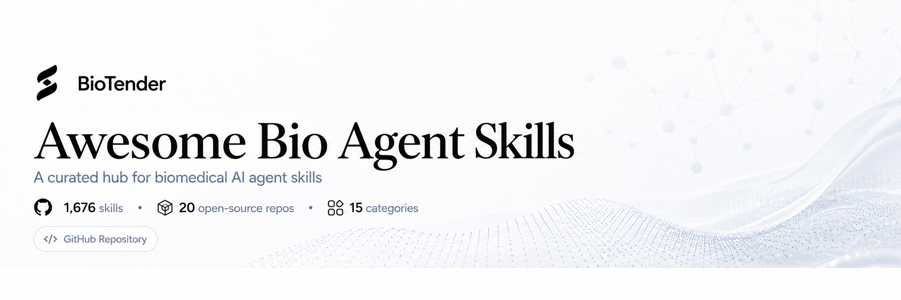

<div align="center">
  <a href="https://github.com/BioTender-max/awesome-bio-agent-skills">
    
  </a>
</div>

<div align="center">

[](https://awesome.re)
[](https://github.com/BioTender-max/awesome-bio-agent-skills/blob/main/bioskill_index_v3.csv)
[](#contents)
[](#sources)
[](LICENSE)
[](https://github.com/BioTender-max/awesome-bio-agent-skills/actions/workflows/awesome-lint.yml)

</div>

<br/>

# Awesome Bio Agent Skills

> A curated collection of AI agent skills for biomedical research, covering genomics, proteomics, single-cell analysis, clinical AI, and protein design.

1,676 deduplicated skills from 20 open-source repositories, organized into 15 categories. Each skill is a self-contained `SKILL.md` folder compatible with Claude-based agent frameworks ([OpenClaw](https://github.com/openclaw/openclaw), [NanoClaw](https://github.com/qwibitai/nanoclaw), [Biomni](https://github.com/Phylo-AI/biomni)).

---

## Contents

- [Genomics](#genomics)
- [Proteomics](#proteomics)
- [Single-Cell Analysis](#single-cell-analysis)
- [Biology and AI](#biology-and-ai)
- [Clinical and Medical](#clinical-and-medical)
- [Transcriptomics](#transcriptomics)
- [Database Query](#database-query)
- [Multi-Omics Integration](#multi-omics-integration)
- [Bioinformatics Utilities](#bioinformatics-utilities)
- [Visualization](#visualization)
- [Workflow Orchestration](#workflow-orchestration)
- [Epigenomics](#epigenomics)
- [Pathway Analysis](#pathway-analysis)
- [Metagenomics](#metagenomics)
- [Protein Design](#protein-design)
- [Sources](#sources)

---

## Genomics

> 526 skills — WGS/WES analysis, variant annotation, GWAS, CNV, structural variants, haplotype phasing, genome assembly.

<details>
<summary>View all 526 skills</summary>

| Skill | Source | Description |
|-------|--------|-------------|
| [bio-alignment-amplicon-clipping](skills/bioskills/alignment-amplicon-clipping/) | bioskills | Trim PCR primers from aligned reads in amplicon-panel BAMs using samtools ampliconclip. Use when processing SARS-CoV-2 ARTIC, hereditary cancer pan... |
| [bio-alignment-filtering](skills/bioskills/alignment-filtering/) | bioskills | Filter alignments by flags, mapping quality, and regions using samtools view and pysam. Use when extracting specific reads, removing low-quality al... |
| [bio-alignment-indexing](skills/bioskills/alignment-indexing/) | bioskills | Create and use BAI/CSI indices for BAM/CRAM files using samtools and pysam. Use when enabling random access to alignment files or fetching specific... |
| [bio-alignment-io](skills/bioskills/alignment-io/) | bioskills | Read, write, and convert multiple sequence alignment files using Biopython Bio.AlignIO. Supports Clustal, PHYLIP, Stockholm, FASTA, Nexus, and othe... |
| [bio-alignment-msa-parsing](skills/bioskills/msa-parsing/) | bioskills | Parse and analyze multiple sequence alignments using Biopython. Extract sequences, identify conserved regions, analyze gaps, work with annotations,... |
| [bio-alignment-msa-statistics](skills/bioskills/msa-statistics/) | bioskills | Calculate alignment statistics including sequence identity, conservation scores, substitution matrices, and similarity metrics. Use when comparing... |
| [bio-alignment-multiple](skills/bioskills/multiple-alignment/) | bioskills | Perform multiple sequence alignment using MAFFT, MUSCLE5, ClustalOmega, or T-Coffee. Guides tool and algorithm selection based on dataset size, seq... |
| [bio-alignment-pairwise](skills/bioskills/pairwise-alignment/) | bioskills | Perform pairwise sequence alignment using Biopython Bio.Align.PairwiseAligner. Use when comparing two sequences, finding optimal alignments, scorin... |
| [bio-alignment-sorting](skills/bioskills/alignment-sorting/) | bioskills | Sort alignment files by coordinate or read name using samtools and pysam. Use when preparing BAM files for indexing, variant calling, or paired-end... |
| [bio-alignment-structural](skills/bioskills/structural-alignment/) | bioskills | Align protein structures using Foldseek 3Di, TM-align, US-align, DALI, or Foldmason for structural MSA. Predict, score, and superpose backbone coor... |
| [bio-alignment-trimming](skills/bioskills/alignment-trimming/) | bioskills | Trim multiple sequence alignments using ClipKIT, trimAl, BMGE, Divvier, or HMMcleaner with mode selection guidance per downstream goal. Use when re... |
| [bio-alignment-validation](skills/bioskills/alignment-validation/) | bioskills | Validate alignment quality with insert size distribution, proper pairing rates, GC bias, strand balance, and other post-alignment metrics. Use when... |
| [bio-atac-seq-allele-specific-accessibility](skills/bioskills/allele-specific-accessibility/) | bioskills | Detect allele-specific chromatin accessibility from ATAC-seq using WASP, GATK ASEReadCounter, or RASQUAL. Use when mapping cis-regulatory genetic v... |
| [bio-atac-seq-atac-peak-calling](skills/bioskills/atac-peak-calling/) | bioskills | Call accessible chromatin regions from ATAC-seq BAM files using MACS3, MACS2, Genrich, or HMMRATAC. Use when identifying open chromatin from aligne... |
| [bio-atac-seq-consensus-peakset](skills/bioskills/consensus-peakset/) | bioskills | Build a differential-ready consensus peakset from per-replicate ATAC-seq peaks using iterative overlap removal, fixed-width re-centering, and major... |
| [bio-bam-statistics](skills/bioskills/bam-statistics/) | bioskills | Generate alignment statistics using samtools flagstat, stats, depth, coverage, and mosdepth. Use when assessing alignment quality, calculating cove... |
| [bio-basecalling](skills/bioskills/basecalling/) | bioskills | Convert raw Nanopore signal data (FAST5/POD5) to nucleotide sequences using Dorado basecaller. Covers model selection, GPU acceleration, modified b... |
| [bio-bedgraph-handling](skills/bioskills/bedgraph-handling/) | bioskills | Create, manipulate, and convert bedGraph files for genome browser visualization. Covers bedGraph format, conversion to/from bigWig, normalization,... |
| [bio-biomart-queries](skills/bioskills/biomart-queries/) | bioskills | Bulk-query Ensembl BioMart (and other BioMart instances) for cross-database ID mapping, gene/transcript/exon coordinates, and ortholog tables. Use... |
| [bio-causal-genomics-colocalization-analysis](skills/bioskills/colocalization-analysis/) | bioskills | Test whether two or more traits share a causal variant at a locus using Bayesian colocalization (coloc.abf, coloc.susie, HyPrColoc, moloc, eCAVIAR,... |
| [bio-causal-genomics-effector-gene-prioritization](skills/bioskills/effector-gene-prioritization/) | bioskills | Maps GWAS-implicated loci to candidate effector (causal) genes by integrating variant-to-gene (V2G) features via Open Targets L2G (Mountjoy 2021),... |
| [bio-causal-genomics-fine-mapping](skills/bioskills/fine-mapping/) | bioskills | Resolves GWAS associations to candidate causal variants and credible sets via SuSiE, susie_rss, FINEMAP, CAVIAR, DAP-G, PAINTOR, PolyFun, SuSiEx, M... |
| [bio-causal-genomics-genetic-correlation](skills/bioskills/genetic-correlation/) | bioskills | Estimate bivariate genetic correlation (rg) between traits from GWAS summary statistics or individual-level genotypes using cross-trait LDSC, HDL,... |
| [bio-causal-genomics-genomic-sem](skills/bioskills/genomic-sem/) | bioskills | Fits structural equation models to GWAS summary statistics using GenomicSEM (Grotzinger 2019), including common-factor models, confirmatory factor... |
| [bio-causal-genomics-mediation-analysis](skills/bioskills/mediation-analysis/) | bioskills | Decompose total effects into direct and indirect paths through mediators using mediation, CMAverse 4-way, HIMA/HIMA2 high-dimensional, BAMA, two-st... |
| [bio-causal-genomics-mendelian-randomization](skills/bioskills/mendelian-randomization/) | bioskills | Estimate causal effects of an exposure on an outcome from GWAS summary statistics using genetic instruments. Implements IVW (fixed/random), MR-Egge... |
| [bio-causal-genomics-pleiotropy-detection](skills/bioskills/pleiotropy-detection/) | bioskills | Detect and adjust for horizontal pleiotropy in two-sample Mendelian randomization by distinguishing uncorrelated (UHP) from correlated (CHP) pleiot... |
| [bio-causal-genomics-proteome-mr-drug-target](skills/bioskills/proteome-mr-drug-target/) | bioskills | Runs cis-pQTL Mendelian randomization for drug-target validation using UKB-PPP (Olink), deCODE (SomaScan), Fenland, INTERVAL, ARIC, and FinnGen-PPP... |
| [bio-causal-genomics-transcriptome-wide-association](skills/bioskills/transcriptome-wide-association/) | bioskills | Performs gene-level association from GWAS summary statistics via genetically predicted tissue expression using FUSION, PrediXcan, S-PrediXcan, S-Mu... |
| [bio-cfdna-preprocessing](skills/bioskills/cfdna-preprocessing/) | bioskills | Preprocesses cell-free DNA sequencing data including adapter trimming, alignment optimized for short fragments, and UMI-aware duplicate removal usi... |
| [bio-chipseq-allele-specific-binding](skills/bioskills/allele-specific-binding/) | bioskills | Detects allele-specific transcription factor or histone modification binding from heterozygous-variant ChIP-seq using WASP (reference-bias filter;... |
| [bio-chipseq-chip-deep-learning](skills/bioskills/chip-deep-learning/) | bioskills | Trains and applies base-resolution deep learning models on ChIP-seq / ChIP-nexus / CUT&RUN data. Uses BPNet (Avsec 2021 Nat Genet 53:354; soft moti... |
| [bio-chipseq-peak-calling](skills/bioskills/peak-calling/) | bioskills | Calls ChIP-seq peaks with MACS3, MACS2, HOMER, or SPP across narrow (TF) and broad (histone) modes. Handles input control matching, fragment-size m... |
| [bio-chipseq-visualization](skills/bioskills/chipseq-visualization/) | bioskills | Visualizes ChIP-seq data using deepTools (computeMatrix, plotHeatmap, plotProfile, bamCoverage, bamCompare), pyGenomeTracks (modern INI-driven trac... |
| [bio-clinical-biostatistics-adaptive-designs](skills/bioskills/adaptive-designs/) | bioskills | Designs adaptive clinical trials including group-sequential (O'Brien-Fleming, Pocock, Lan-DeMets spending), sample-size re-estimation (blinded Frie... |
| [bio-clinical-biostatistics-categorical-tests](skills/bioskills/categorical-tests/) | bioskills | Tests associations between categorical variables in clinical data using chi-square, Fisher's exact, Boschloo, Cochran-Mantel-Haenszel, and modern M... |
| [bio-clinical-biostatistics-power-sample-size](skills/bioskills/power-and-sample-size/) | bioskills | Computes sample size and power for clinical trials including continuous, binary, and time-to-event endpoints; superiority, non-inferiority, and equ... |
| [bio-clinical-databases-acmg-classification](skills/bioskills/acmg-classification/) | bioskills | Applies ACMG/AMP 2015 framework with ClinGen SVI specifications, Tavtigian 2018/2020 Bayesian point system, Abou Tayoun 2018 PVS1 decision tree, Pe... |
| [bio-clinical-databases-clinvar-lookup](skills/bioskills/clinvar-lookup/) | bioskills | Queries ClinVar for variant pathogenicity classifications, ClinGen VCEP curations, and somatic-vs-germline interpretations via REST API, weekly VCF... |
| [bio-clinical-databases-dbsnp-queries](skills/bioskills/dbsnp-queries/) | bioskills | Resolves rsIDs, navigates RsMergeArch/SNPHistory merge chains, and converts between rsID, SPDI, HGVS, and VCF representations using the dbSNP Build... |

*...and 486 additional genomics skills in the [skills/bioskills/](skills/bioskills/), [skills/openclaw/](skills/openclaw/), [skills/sciagent/](skills/sciagent/) directories.*

</details>

---
## Proteomics

> 167 skills — mass spectrometry analysis, structure prediction, protein design, binding affinity optimization.

<details>
<summary>View all 167 skills</summary>

| Skill | Source | Description |
|-------|--------|-------------|
| [bio-atac-seq-nucleosome-positioning](skills/bioskills/nucleosome-positioning/) | bioskills | Map nucleosome center positions, occupancy, and fuzziness from ATAC-seq fragment-size patterns using NucleoATAC, ATACseqQC, DANPOS3, or scprinter.... |
| [bio-data-visualization-sequence-logos](skills/bioskills/sequence-logos/) | bioskills | Build sequence logos from aligned DNA, RNA, or protein motifs using ggseqlogo (R), Logomaker (Python), or WebLogo with explicit bits vs probability... |
| [bio-generative-design](skills/bioskills/generative-design/) | bioskills | Designs novel molecules using REINVENT 4 (de novo, scaffold decoration, linker design, R-group, molecular optimization), MolMIM, Diffusion-based ge... |
| [bio-hi-c-analysis-hic-differential](skills/bioskills/hic-differential/) | bioskills | Compare Hi-C contact matrices between conditions to identify differential chromatin interactions. Compute log2 fold changes, statistical significan... |
| [bio-hi-c-analysis-tad-detection](skills/bioskills/tad-detection/) | bioskills | Call topologically associating domains (TADs) from Hi-C data using insulation score, HiCExplorer, and other methods. Identify domain boundaries and... |
| [bio-immunoinformatics-mhc-binding-prediction](skills/bioskills/mhc-binding-prediction/) | bioskills | Predict peptide-MHC class I and II binding affinity using MHCflurry and NetMHCpan neural network models. Identify potential T-cell epitopes from pr... |
| [bio-immunoinformatics-neoantigen-prediction](skills/bioskills/neoantigen-prediction/) | bioskills | Identify tumor neoantigens from somatic mutations using pVACtools for personalized cancer immunotherapy. Predict mutant peptides that bind patient... |
| [bio-interaction-databases](skills/bioskills/interaction-databases/) | bioskills | Query protein-protein and gene interaction databases (STRING, BioGRID, IntAct, SIGNOR, Reactome, HuRI, HuMAP, OmniPath, ConsensusPathDB, DIP). Use... |
| [bio-ml-docking-rescoring](skills/bioskills/ml-docking-rescoring/) | bioskills | Performs ML-based protein-ligand pose prediction and scoring using DiffDock-L (diffusion-based), Boltz-1 / Boltz-2 (foundation model with affinity)... |
| [bio-molecular-io](skills/bioskills/molecular-io/) | bioskills | Reads, writes, and converts molecular file formats (SMILES, InChI, SDF V2000/V3000, MOL2, PDB, MMTF) using RDKit and Open Babel with rigorous handl... |
| [bio-molecular-standardization](skills/bioskills/molecular-standardization/) | bioskills | Standardizes molecular structures using ChEMBL chembl_structure_pipeline and RDKit rdMolStandardize covering sanitization, salt/solvent stripping,... |
| [bio-pdb-geometric-analysis](skills/bioskills/geometric-analysis/) | bioskills | Perform geometric calculations on protein structures using Biopython Bio.PDB. Use when measuring distances, angles, and dihedrals, superimposing st... |
| [bio-pdb-structure-io](skills/bioskills/structure-io/) | bioskills | Parse and write protein structure files using Biopython Bio.PDB. Use when reading PDB, mmCIF, and MMTF files, downloading structures from RCSB PDB,... |
| [bio-pdb-structure-modification](skills/bioskills/structure-modification/) | bioskills | Modify protein structures using Biopython Bio.PDB. Use when transforming coordinates, removing atoms or residues, adding new entities, modifying B-... |
| [bio-pdb-structure-navigation](skills/bioskills/structure-navigation/) | bioskills | Navigate protein structure hierarchy using Biopython Bio.PDB SMCRA model. Use when accessing models, chains, residues, and atoms, iterating over st... |
| [bio-phylo-tree-manipulation](skills/bioskills/tree-manipulation/) | bioskills | Modify phylogenetic tree structure using Biopython Bio.Phylo. Use when rooting trees with outgroups, midpoint, or MAD methods, pruning taxa, collap... |
| [bio-population-genetics-population-structure](skills/bioskills/population-structure/) | bioskills | Analyze population structure using PCA and admixture analysis with PLINK and ADMIXTURE. Identify population clusters, assess ancestry proportions,... |
| [bio-pose-validation](skills/bioskills/pose-validation/) | bioskills | Validates docked / generated protein-ligand poses using PoseBusters physical-validity tests, strain energy quantification, geometric checks (planar... |
| [bio-primer-design-primer-validation](skills/bioskills/primer-validation/) | bioskills | Validate PCR primers for specificity, dimers, hairpins, and secondary structures using primer3-py thermodynamic calculations. Check self-complement... |
| [bio-protac-degraders](skills/bioskills/protac-degraders/) | bioskills | Designs PROTACs, molecular glues, and bivalent degraders with explicit handling of E3 ligase choice (VHL, CRBN, IAP, MDM2, KEAP1), linker design (l... |
| [bio-proteomics-data-import](skills/bioskills/data-import/) | bioskills | Load and parse mass spectrometry data formats including mzML, mzXML, and quantification tool outputs like MaxQuant proteinGroups.txt. Use when star... |
| [bio-proteomics-dia-analysis](skills/bioskills/dia-analysis/) | bioskills | Data-independent acquisition (DIA) proteomics analysis with DIA-NN and other tools. Use when analyzing DIA mass spectrometry data with library-free... |
| [bio-proteomics-peptide-identification](skills/bioskills/peptide-identification/) | bioskills | Peptide-spectrum matching and protein identification from MS/MS data. Use when identifying peptides from tandem mass spectra. Covers database searc... |
| [bio-proteomics-protein-inference](skills/bioskills/protein-inference/) | bioskills | Protein grouping and inference from peptide identifications. Use when resolving protein ambiguity from shared peptides. Handles protein groups and... |
| [bio-proteomics-quantification](skills/bioskills/quantification/) | bioskills | Protein quantification from mass spectrometry data including label-free (LFQ, intensity-based), isobaric labeling (TMT, iTRAQ), and metabolic label... |
| [bio-proteomics-spectral-libraries](skills/bioskills/spectral-libraries/) | bioskills | Build, manage, and search spectral libraries for proteomics. Use when creating or working with spectral libraries for DIA analysis. Covers DDA-base... |
| [bio-qsar-modeling](skills/bioskills/qsar-modeling/) | bioskills | Builds QSAR / QSPR models using chemprop D-MPNN, MolFormer, Uni-Mol, ChemBERTa, random forest baselines, and Gaussian processes with explicit handl... |
| [bio-rna-structure-ncrna-search](skills/bioskills/ncrna-search/) | bioskills | Searches for non-coding RNA homologs and classifies RNA families using Infernal covariance model searches against the Rfam database. Identifies str... |
| [bio-rna-structure-structure-probing](skills/bioskills/structure-probing/) | bioskills | Analyzes experimental RNA structure probing data from SHAPE-MaP and DMS-MaPseq experiments using ShapeMapper2. Converts mutation rates to per-nucle... |
| [bio-scaffold-analysis](skills/bioskills/scaffold-analysis/) | bioskills | Analyzes chemical libraries by scaffold using Bemis-Murcko scaffolds, generic frameworks, cyclic skeletons, matched molecular pair (MMP) analysis v... |
| [bio-similarity-searching](skills/bioskills/similarity-searching/) | bioskills | Performs molecular similarity searching using Tanimoto, Tversky, Dice, and cosine coefficients on bit/count fingerprints with explicit choice rules... |
| [bio-structural-biology-alphafold-predictions](skills/bioskills/alphafold-predictions/) | bioskills | Access and analyze AlphaFold protein structure predictions. Use when predicted structures are needed for proteins without experimental structures,... |
| [bio-structural-biology-modern-structure-prediction](skills/bioskills/modern-structure-prediction/) | bioskills | Predict protein structures using modern ML models including AlphaFold3, ESMFold, Chai-1, and Boltz-1. Use when predicting structures for novel prot... |
| [bio-substructure-search](skills/bioskills/substructure-search/) | bioskills | Searches molecular libraries for substructure matches using SMARTS patterns with explicit handling of recursive SMARTS, ring membership, aromaticit... |
| [bio-transcription-translation](skills/bioskills/transcription-translation/) | bioskills | Transcribe DNA to RNA and translate to protein using Biopython. Use when converting between DNA, RNA, and protein sequences, finding ORFs, or using... |
| [bio-virtual-screening](skills/bioskills/virtual-screening/) | bioskills | Performs structure-based virtual screening using AutoDock Vina, SMINA, GNINA (CNN scoring), and DiffDock-L hybrid workflows with explicit choice ru... |
| [adhd-daily-planner](skills/openclaw/adhd-daily-planner/) | openclaw | Time-blind friendly planning, executive function support, and daily structure for ADHD brains. Specializes in realistic time estimation, dopamine-a... |
| [alphafold-database](skills/openclaw/alphafold-database/) | openclaw | Access AlphaFold's 200M+ AI-predicted protein structures. Retrieve structures by UniProt ID, download PDB/mmCIF files, analyze confidence metrics (... |
| [antibody-design-agent](skills/openclaw/antibody-design-agent/) | openclaw | An advanced agent for de novo antibody design and optimization using state-of-the-art protein language models (MAGE, RFdiffusion). |
| [bindingdb-database](skills/openclaw/bindingdb-database/) | openclaw | Query BindingDB for measured drug-target binding affinities (Ki, Kd, IC50, EC50). Search by target (UniProt ID), compound (SMILES/name), or pathoge... |

*...and 127 additional proteomics skills in the [skills/kdense/](skills/kdense/), [skills/openclaw/](skills/openclaw/), [skills/sciagent/](skills/sciagent/) directories.*

</details>

---
## Single-Cell Analysis

> 144 skills — preprocessing, clustering, cell type annotation, trajectory inference, cell communication, multimodal integration.

<details>
<summary>View all 144 skills</summary>

| Skill | Source | Description |
|-------|--------|-------------|
| [bio-atac-seq-co-accessibility](skills/bioskills/co-accessibility/) | bioskills | Infer cis-regulatory connections (peak-to-peak co-accessibility) from scATAC-seq using Cicero, ArchR getCoAccessibility, or SCENIC+. Use when linki... |
| [bio-atac-seq-deep-learning-atac](skills/bioskills/deep-learning-atac/) | bioskills | Sequence-based deep learning for ATAC-seq using chromBPNet, BPNet, scBasset, or EnFormer. Use when correcting Tn5 bias with neural networks beyond... |
| [bio-atac-seq-enhancer-gene-linking](skills/bioskills/enhancer-gene-linking/) | bioskills | Predict enhancer-gene regulatory connections from ATAC-seq using ABC, ENCODE-rE2G, HiChIP, or Cicero. Use when linking distal enhancers to target g... |
| [bio-atac-seq-motif-deviation](skills/bioskills/motif-deviation/) | bioskills | Analyze TF motif accessibility variability across samples or single cells using chromVAR. Use when identifying TF motifs whose accessibility correl... |
| [bio-atac-seq-single-cell-atac](skills/bioskills/single-cell-atac/) | bioskills | Process and analyze single-cell ATAC-seq data with Signac, ArchR, SnapATAC2, or Cell Ranger ATAC. Use when handling 10X scATAC or 10X Multiome (pai... |
| [bio-causal-genomics-heritability-partitioning](skills/bioskills/heritability-partitioning/) | bioskills | Estimate SNP heritability and partition it across functional annotations, cell types, and loci from GWAS summary statistics or individual-level gen... |
| [bio-chipseq-chromatin-state-segmentation](skills/bioskills/chromatin-state-segmentation/) | bioskills | Segments the genome into chromatin states from combinatorial histone modification and chromatin factor ChIP-seq data. Uses ChromHMM (multivariate H... |
| [bio-chipseq-peak-annotation](skills/bioskills/peak-annotation/) | bioskills | Annotates ChIP-seq peaks to genomic features, nearest genes, ENCODE candidate cis-regulatory elements (cCREs), and regulatory domains. Uses ChIPsee... |
| [bio-clip-seq-stamp-antibody-free](skills/bioskills/stamp-antibody-free/) | bioskills | Profiles RNA-binding protein targets without antibody or UV crosslinking using STAMP (APOBEC1-RBP fusion, C-to-U editing), scSTAMP (single-cell), T... |
| [bio-crispr-screens-combinatorial-screens](skills/bioskills/combinatorial-screens/) | bioskills | Designs and analyzes combinatorial CRISPR screens covering paired-Cas9 (Big Papi, Najm 2018), enhanced AsCas12a multiplex (enCas12a, DeWeirdt 2021)... |
| [bio-crispr-screens-perturb-seq-analysis](skills/bioskills/perturb-seq-analysis/) | bioskills | Analyzes single-cell pooled CRISPR screens (Perturb-seq, CROP-seq, Perturb-CITE-seq, ECCITE-seq, multiome) where each cell carries an sgRNA and a s... |
| [bio-data-visualization-dimensionality-reduction-plots](skills/bioskills/dimensionality-reduction-plots/) | bioskills | Produce and interpret PCA, t-SNE, UMAP, and PHATE plots for high-dimensional omics data with rigor about which method preserves what (variance, loc... |
| [bio-data-visualization-matplotlib-fundamentals](skills/bioskills/matplotlib-fundamentals/) | bioskills | Build publication-quality figures with matplotlib using the object-oriented Figure/Axes API, constrained_layout, rcParams customization, TrueType (... |
| [bio-expression-matrix-normalization](skills/bioskills/normalization/) | bioskills | Normalize and transform RNA-seq count matrices for differential expression, visualization, and clustering. Covers between-sample (TMM, RLE, upper q... |
| [bio-expression-matrix-sparse-handling](skills/bioskills/sparse-handling/) | bioskills | Work with sparse matrices for memory-efficient storage of count data. Use when dealing with single-cell data or large bulk RNA-seq datasets where m... |
| [bio-flow-cytometry-clustering-phenotyping](skills/bioskills/clustering-phenotyping/) | bioskills | Unsupervised clustering and cell type identification for flow/mass cytometry. Covers FlowSOM, Phenograph, and CATALYST workflows. Use when discover... |
| [bio-flow-cytometry-doublet-detection](skills/bioskills/doublet-detection/) | bioskills | Detect and remove doublets from flow and mass cytometry data. Covers FSC/SSC gating and computational doublet detection methods. Use when filtering... |
| [bio-flow-cytometry-doublet-detection](skills/bioskills/flow-cytometry__doublet-detection/) | bioskills | Detect and remove doublets from flow and mass cytometry data. Covers FSC/SSC gating and computational doublet detection methods. Use when filtering... |
| [bio-gene-regulatory-networks-coexpression-networks](skills/bioskills/coexpression-networks/) | bioskills | Build weighted gene co-expression networks to identify modules of co-regulated genes and relate them to phenotypes using WGCNA and CEMiTool. Detect... |
| [bio-gene-regulatory-networks-multiomics-grn](skills/bioskills/multiomics-grn/) | bioskills | Build enhancer-driven gene regulatory networks by integrating single-cell RNA-seq and ATAC-seq data using SCENIC+ to identify eRegulons linking tra... |
| [bio-gene-regulatory-networks-scenic-regulons](skills/bioskills/scenic-regulons/) | bioskills | Infer gene regulatory networks and identify transcription factor regulons from single-cell RNA-seq data using pySCENIC. Discovers co-expression mod... |
| [bio-imaging-mass-cytometry-cell-segmentation](skills/bioskills/cell-segmentation/) | bioskills | Cell segmentation from multiplexed tissue images. Covers deep learning (Cellpose, Mesmer) and classical approaches for nuclear and whole-cell segme... |
| [bio-imaging-mass-cytometry-interactive-annotation](skills/bioskills/interactive-annotation/) | bioskills | Interactive cell type annotation for IMC data. Covers napari-based annotation, marker-guided labeling, training data generation, and annotation val... |
| [bio-imaging-mass-cytometry-phenotyping](skills/bioskills/phenotyping/) | bioskills | Cell type assignment from marker expression in IMC data. Covers manual gating, clustering, and automated classification approaches. Use when assign... |
| [bio-imaging-mass-cytometry-spatial-analysis](skills/bioskills/spatial-analysis/) | bioskills | Spatial analysis of cell neighborhoods and interactions in IMC data. Covers neighbor graphs, spatial statistics, and interaction testing. Use when... |
| [bio-machine-learning-atlas-mapping](skills/bioskills/atlas-mapping/) | bioskills | Maps query single-cell data to reference atlases using scArches transfer learning with scVI and scANVI models. Transfers cell type labels without r... |
| [bio-methylation-dmr-detection](skills/bioskills/dmr-detection/) | bioskills | Differentially methylated region (DMR) detection using methylKit tiles, bsseq BSmooth, and DMRcate. Use when identifying contiguous genomic regions... |
| [bio-read-qc-umi-processing](skills/bioskills/umi-processing/) | bioskills | Extract, process, and deduplicate reads using Unique Molecular Identifiers (UMIs) with umi_tools. Use when library prep includes UMIs and accurate... |
| [bio-single-cell-batch-integration](skills/bioskills/batch-integration/) | bioskills | Integrate multiple scRNA-seq samples/batches using Harmony, scVI, Seurat anchors, and fastMNN. Remove technical variation while preserving biologic... |
| [bio-single-cell-cell-annotation](skills/bioskills/cell-annotation/) | bioskills | Automated cell type annotation using reference-based methods including CellTypist, scPred, SingleR, and Azimuth for consistent, reproducible cell l... |
| [bio-single-cell-cell-communication](skills/bioskills/cell-communication/) | bioskills | Infer cell-cell communication networks from scRNA-seq data using CellChat, NicheNet, and LIANA for ligand-receptor interaction analysis. Use when i... |
| [bio-single-cell-clustering](skills/bioskills/clustering/) | bioskills | Dimensionality reduction and clustering for single-cell RNA-seq using Seurat (R) and Scanpy (Python). Use for running PCA, computing neighbors, clu... |
| [bio-single-cell-data-io](skills/bioskills/data-io/) | bioskills | Read, write, and create single-cell data objects using Seurat (R) and Scanpy (Python). Use for loading 10X Genomics data, importing/exporting h5ad... |
| [bio-single-cell-doublet-detection](skills/bioskills/bioskills__single-cell__doublet-detection/) | bioskills | Detect and remove doublets (multiple cells captured in one droplet) from single-cell RNA-seq data. Uses Scrublet (Python), DoubletFinder (R), and s... |
| [bio-single-cell-doublet-detection](skills/bioskills/single-cell__doublet-detection/) | bioskills | Detect and remove doublets (multiple cells captured in one droplet) from single-cell RNA-seq data. Uses Scrublet (Python), DoubletFinder (R), and s... |
| [bio-single-cell-lineage-tracing](skills/bioskills/lineage-tracing/) | bioskills | Reconstruct cell lineage trees from CRISPR barcode tracing or mitochondrial mutations. Use when studying clonal dynamics, cell fate decisions, or d... |
| [bio-single-cell-markers-annotation](skills/bioskills/markers-annotation/) | bioskills | Find marker genes and annotate cell types in single-cell RNA-seq using Seurat (R) and Scanpy (Python). Use for differential expression between clus... |
| [bio-single-cell-metabolite-communication](skills/bioskills/metabolite-communication/) | bioskills | Analyze metabolite-mediated cell-cell communication using MeboCost for metabolic signaling inference between cell types. Predict metabolite secreti... |
| [bio-single-cell-multimodal-integration](skills/bioskills/multimodal-integration/) | bioskills | Analyze multi-modal single-cell data (CITE-seq, Multiome, spatial). Use when working with data that measures multiple modalities per cell like RNA... |
| [bio-single-cell-perturb-seq](skills/bioskills/perturb-seq/) | bioskills | Analyze Perturb-seq and CROP-seq CRISPR screening data integrated with scRNA-seq. Use when identifying gene function through pooled genetic perturb... |

*...and 104 additional single-cell analysis skills in the [skills/openclaw/](skills/openclaw/), [skills/bioskills/](skills/bioskills/), [skills/sciagent/](skills/sciagent/) directories.*

</details>

---
## Biology and AI

> 236 skills — medical AI, clinical decision support, drug discovery, general biological tools.

<details>
<summary>View all 236 skills</summary>

| Skill | Source | Description |
|-------|--------|-------------|
| [bio-flow-cytometry-bead-normalization](skills/bioskills/bead-normalization/) | bioskills | Bead-based normalization for CyTOF and high-parameter flow cytometry. Covers EQ bead normalization, signal drift correction, and batch normalizatio... |
| [bio-flow-cytometry-fcs-handling](skills/bioskills/fcs-handling/) | bioskills | Read and manipulate Flow Cytometry Standard (FCS) files. Covers loading data, accessing parameters, and basic data exploration. Use when loading an... |
| [bio-immunoinformatics-tcr-epitope-binding](skills/bioskills/tcr-epitope-binding/) | bioskills | Predict TCR-epitope specificity using ERGO-II and deep learning models for T-cell receptor antigen recognition. Match TCRs to their cognate epitope... |
| [bio-molecular-descriptors](skills/bioskills/molecular-descriptors/) | bioskills | Calculates molecular fingerprints (ECFP/Morgan, FCFP, MACCS, RDKit, AtomPair, TopologicalTorsion, Avalon, MAP4, MHFP6) and physicochemical descript... |
| [bio-phylo-divergence-dating](skills/bioskills/divergence-dating/) | bioskills | Estimate divergence times using molecular clock models with BEAST2, MCMCTree, and TreePL. Use when dating speciation events, calibrating phylogenie... |
| [bio-phylo-species-trees](skills/bioskills/species-trees/) | bioskills | Estimate species trees using coalescent methods including ASTRAL-III, wASTRAL, ASTRAL-Pro, SVDQuartets, and BPP. Use when multi-locus data shows ge... |
| [bio-phylo-tree-io](skills/bioskills/tree-io/) | bioskills | Read, write, and convert phylogenetic tree files using Biopython Bio.Phylo. Use when parsing Newick, Nexus, PhyloXML, or NeXML tree formats, conver... |
| [bio-reporting-quarto-reports](skills/bioskills/quarto-reports/) | bioskills | Build reproducible scientific documents, presentations, and websites with Quarto supporting R, Python, Julia, and Observable JS. Use when creating... |
| [bio-ribo-seq-ribosome-stalling](skills/bioskills/ribosome-stalling/) | bioskills | Detect ribosome pausing and stalling sites from Ribo-seq data at codon resolution. Use when studying translational regulation, identifying pause si... |
| [aav-vector-design-agent](skills/openclaw/aav-vector-design-agent/) | openclaw | AI-powered adeno-associated virus (AAV) vector design for gene therapy including capsid engineering, promoter selection, and tropism optimization. |
| [ai-analyzer](skills/openclaw/ai-analyzer/) | openclaw | AI驱动的综合健康分析系统，整合多维度健康数据、识别异常模式、预测健康风险、提供个性化建议。支持智能问答和AI健康报告生成。 |
| [bayesian-optimizer](skills/openclaw/bayesian-optimizer/) | openclaw | Bayesian Optimize |
| [biokernel](skills/openclaw/biokernel/) | openclaw | Biomedical OS Core & MCP Server |
| [biologist-analyst](skills/openclaw/biologist-analyst/) | openclaw | Analyzes living systems and biological phenomena through biological lens using evolution, molecular biology, ecology, and systems biology framework... |
| [biomcp-server](skills/openclaw/biomcp-server/) | openclaw | MCP bio bridge |
| [brainstorming](skills/openclaw/brainstorming/) | openclaw | You MUST use this before any creative work - creating features, building components, adding functionality, or modifying behavior. Explores user int... |
| [cellagent-annotation](skills/openclaw/cellagent-annotation/) | openclaw | Cell tagger |
| [chemist-analyst](skills/openclaw/chemist-analyst/) | openclaw | Analyzes events through chemistry lens using molecular structure, reaction mechanisms, thermodynamics, kinetics, and analytical techniques (spectro... |
| [computational-pathology-agent](skills/openclaw/computational-pathology-agent/) | openclaw | Analyze Whole Slide Images (WSI) for digital pathology, including tissue segmentation and feature extraction. |
| [crisis-response-protocol](skills/openclaw/crisis-response-protocol/) | openclaw | Handle mental health crisis situations in AI coaching safely. Use when implementing crisis detection, safety protocols, emergency escalation, or su... |
| [crispr-guide-design](skills/openclaw/crispr-guide-design/) | openclaw | Guide foundry |
| [data-transform](skills/openclaw/data-transform/) | openclaw | Transform, clean, reshape, and preprocess data using pandas and numpy. Works with ANY LLM provider (GPT, Gemini, Claude, etc.). |
| [differentiation-schemes](skills/openclaw/differentiation-schemes/) | openclaw | Select and apply numerical differentiation schemes for PDE/ODE discretization. Use when choosing finite difference/volume/spectral schemes, buildin... |
| [dispatching-parallel-agents](skills/openclaw/dispatching-parallel-agents/) | openclaw | Use when facing 2+ independent tasks that can be worked on without shared state or sequential dependencies |
| [emergency-card](skills/openclaw/emergency-card/) | openclaw | 生成紧急情况下快速访问的医疗信息摘要卡片。当用户需要旅行、就诊准备、紧急情况或询问"紧急信息"、"医疗卡片"、"急救信息"时使用此技能。提取关键信息（过敏、用药、急症、植入物），支持多格式输出（JSON、文本、二维码），用于急救或快速就医。 |
| [epidemiologist-analyst](skills/openclaw/epidemiologist-analyst/) | openclaw | Analyzes disease patterns and health events through epidemiological lens using surveillance systems, outbreak investigation methods, and disease mo... |
| [executing-plans](skills/openclaw/executing-plans/) | openclaw | Use when you have a written implementation plan to execute in a separate session with review checkpoints |
| [family-health-analyzer](skills/openclaw/family-health-analyzer/) | openclaw | 分析家族病史、评估遗传风险、识别家庭健康模式、提供个性化预防建议 |
| [fhir-developer-skill](skills/openclaw/fhir-developer-skill/) | openclaw | FHIR API development guide for building healthcare endpoints. Use when: (1) Creating FHIR REST endpoints (Patient, Observation, Encounter, Conditio... |
| [find-skills](skills/openclaw/find-skills/) | openclaw | Helps users discover and install agent skills when they ask questions like "how do I do X", "find a skill for X", "is there a skill that can...", o... |
| [fitness-analyzer](skills/openclaw/fitness-analyzer/) | openclaw | 分析运动数据、识别运动模式、评估健身进展，并提供个性化训练建议。支持与慢性病数据的关联分析。 |
| [goal-analyzer](skills/openclaw/goal-analyzer/) | openclaw | 分析健康目标数据、识别目标模式、评估目标进度,并提供个性化目标管理建议。支持与营养、运动、睡眠等健康数据的关联分析。 |
| [grief-companion](skills/openclaw/grief-companion/) | openclaw | Compassionate bereavement support, memorial creation, grief education, and healing journey guidance. Specializes in understanding grief stages, cre... |
| [health-trend-analyzer](skills/openclaw/health-trend-analyzer/) | openclaw | 分析一段时间内健康数据的趋势和模式。关联药物、症状、生命体征、化验结果和其他健康指标的变化。识别令人担忧的趋势、改善情况，并提供数据驱动的洞察。当用户询问健康趋势、模式、随时间的变化或"我的健康状况有什么变化？"时使用。支持多维度分析（体重/BMI、症状、药物依从性、化验结果、情绪睡眠），相关... |
| [hipaa-compliance](skills/openclaw/hipaa-compliance/) | openclaw | Ensure HIPAA compliance when handling PHI (Protected Health Information). Use when writing code that accesses user health data, check-ins, journal... |
| [kragen-knowledge-graph](skills/openclaw/kragen-knowledge-graph/) | openclaw | Graph-RAG Solver |
| [leads-literature-mining](skills/openclaw/leads-literature-mining/) | openclaw | Review Automator |
| [medical-imaging-review](skills/openclaw/medical-imaging-review/) | openclaw | Write comprehensive literature reviews for medical imaging AI research. Use when writing survey papers, systematic reviews, or literature analyses... |
| [mental-health-analyzer](skills/openclaw/mental-health-analyzer/) | openclaw | 分析心理健康数据、识别心理模式、评估心理健康状况、提供个性化心理健康建议。支持与睡眠、运动、营养等其他健康数据的关联分析。 |
| [mesh-generation](skills/openclaw/mesh-generation/) | openclaw | Plan and evaluate mesh generation for numerical simulations. Use when choosing grid resolution, checking aspect ratios/skewness, estimating mesh qu... |

*...and 196 additional biology and ai skills in the [skills/nobel/](skills/nobel/), [skills/openclaw/](skills/openclaw/), [skills/neuroclaw/](skills/neuroclaw/) directories.*

</details>

---
## Clinical and Medical

> 152 skills — EHR analysis, clinical trial design, drug interactions, precision medicine, adverse event detection.

<details>
<summary>View all 152 skills</summary>

| Skill | Source | Description |
|-------|--------|-------------|
| [bio-admet-prediction](skills/bioskills/admet-prediction/) | bioskills | Predicts ADMET properties using ADMETlab 3.0 (119 endpoints with uncertainty), ADMET-AI, DeepChem MolNet, and chemprop D-MPNN with explicit handlin... |
| [bio-clinical-biostatistics-bayesian-trials](skills/bioskills/bayesian-trials/) | bioskills | Designs Bayesian clinical trials including Phase I dose-finding (BOIN, CRM, EWOC, mTPI-2), meta-analytic-predictive (MAP) priors with robust mixtur... |
| [bio-clinical-biostatistics-cdisc-data](skills/bioskills/cdisc-data-handling/) | bioskills | Reads, validates, and prepares CDISC SDTM and ADaM clinical trial data for analysis. Covers SDTM domain joins (DM, AE, EX, VS, LB, DS), ADaM archit... |
| [bio-clinical-biostatistics-effect-measures](skills/bioskills/effect-measures/) | bioskills | Computes and interprets treatment effect measures (OR, RR, RD, HR, NNT) with calibrated confidence intervals (Wilson, Newcombe, Miettinen-Nurminen,... |
| [bio-clinical-biostatistics-logistic-regression](skills/bioskills/logistic-regression/) | bioskills | Performs logistic regression for clinical trial outcomes (binary, ordinal, multinomial) with marginal-vs-conditional estimand reporting per FDA 202... |
| [bio-clinical-biostatistics-missing-data](skills/bioskills/missing-data-sensitivity/) | bioskills | Implements missing-data sensitivity analyses for confirmatory clinical trials including MMRM under MAR (with Kenward-Roger correction), reference-b... |
| [bio-clinical-biostatistics-multiplicity-graphical](skills/bioskills/multiplicity-graphical/) | bioskills | Implements multiplicity control for confirmatory clinical trials using graphical procedures (Bretz-Maurer-Hommel), gatekeeping (parallel, serial, m... |
| [bio-clinical-biostatistics-subgroup-analysis](skills/bioskills/subgroup-analysis/) | bioskills | Performs subgroup and heterogeneous treatment effect (HTE) analyses for clinical trials. Covers Mantel-Haenszel pooling, Breslow-Day, interaction t... |
| [bio-clinical-biostatistics-trial-reporting](skills/bioskills/trial-reporting/) | bioskills | Prepares statistical reports for clinical trials following CONSORT 2025, SPIRIT 2025, ICH E9(R1) estimands, and FDA 2023 covariate adjustment guida... |
| [bio-clinical-databases-polygenic-risk](skills/bioskills/polygenic-risk/) | bioskills | Constructs and validates polygenic risk scores using LDpred2-auto, SBayesRC, MegaPRS, PRS-CS, PROSPER, MUSSEL, BridgePRS, JointPRS, PRSmix, or PGS... |
| [bio-covalent-design](skills/bioskills/covalent-design/) | bioskills | Designs covalent inhibitors and warheads targeting cysteine (most common, 98% of covalent drugs), lysine, serine, threonine, tyrosine, and aspartat... |
| [bio-systems-biology-gene-essentiality](skills/bioskills/gene-essentiality/) | bioskills | Perform in silico gene knockout analysis and synthetic lethality screens using COBRApy single and double deletions. Predict essential genes and ide... |
| [bio-workflows-clinical-trial-pipeline](skills/bioskills/clinical-trial-pipeline/) | bioskills | End-to-end clinical trial analysis workflow from CDISC SDTM/ADaM loading through ICH E9(R1) estimand-driven primary analysis to CONSORT 2025 regula... |
| [bio-workflows-outbreak-pipeline](skills/bioskills/outbreak-pipeline/) | bioskills | End-to-end outbreak investigation from pathogen isolates to transmission networks. Orchestrates MLST typing, AMR surveillance, phylodynamic dating,... |
| [agentd-drug-discovery](skills/openclaw/agentd-drug-discovery/) | openclaw | Use the AgentD workflow to mine evidence, design molecules, and rank candidates with SAR plus ADMET annotations for early drug discovery tasks. |
| [autonomous-oncology-agent](skills/openclaw/autonomous-oncology-agent/) | openclaw | Precision Oncology |
| [biomedical-search](skills/openclaw/biomedical-search/) | openclaw | Complete biomedical information search combining PubMed, preprints, clinical trials, and FDA drug labels. Powered by Valyu semantic search. |
| [cancer-metabolism-agent](skills/openclaw/cancer-metabolism-agent/) | openclaw | AI-powered analysis of cancer metabolic reprogramming including Warburg effect, glutamine addiction, lipid metabolism, and metabolic vulnerabilitie... |
| [cart-design-optimizer-agent](skills/openclaw/cart-design-optimizer-agent/) | openclaw | AI-guided CAR-T cell design for solid tumors using antigen prioritization, safety-by-design architectures, and exhaustion-resistant engineering. |
| [cellular-senescence-agent](skills/openclaw/cellular-senescence-agent/) | openclaw | AI-powered analysis of cellular senescence for aging research, cancer therapy response, and senolytic drug development. |
| [chatehr-clinician-assistant](skills/openclaw/chatehr-clinician-assistant/) | openclaw | EHR Chat Assistant |
| [chematagent-drug-discovery](skills/openclaw/chematagent-drug-discovery/) | openclaw | Chemical Lab Agent |
| [chemcrow-drug-discovery](skills/openclaw/chemcrow-drug-discovery/) | openclaw | An LLM chemistry agent with expert-designed tools for organic synthesis, drug discovery, and materials design. |
| [chemical-property-lookup](skills/openclaw/chemical-property-lookup/) | openclaw | Compute RDKit-driven molecular properties (MW, logP, TPSA, QED, Lipinski) for a SMILES string to support downstream drug discovery tools. |
| [chromosomal-instability-agent](skills/openclaw/chromosomal-instability-agent/) | openclaw | AI-powered analysis of chromosomal instability (CIN) signatures for cancer prognosis, immunotherapy response prediction, and therapeutic vulnerabil... |
| [clinical-diagnostic-reasoning](skills/openclaw/clinical-diagnostic-reasoning/) | openclaw | Identify and counteract cognitive biases in medical decision-making through systematic error analysis and contextual algorithm application. For dia... |
| [clinical-trial-protocol-skill](skills/openclaw/clinical-trial-protocol-skill/) | openclaw | Generate clinical trial protocols for medical devices or drugs. This skill should be used when users say "Create a clinical trial protocol", "Gener... |
| [clinical-trials-search](skills/openclaw/clinical-trials-search/) | openclaw | Search ClinicalTrials.gov with natural language queries. Find clinical trials, enrollment, and outcomes using Valyu semantic search. |
| [clinicaltrials-database](skills/openclaw/clinicaltrials-database/) | openclaw | Query ClinicalTrials.gov via API v2. Search trials by condition, drug, location, status, or phase. Retrieve trial details by NCT ID, export data, f... |
| [ctdna-dynamics-mrd-agent](skills/openclaw/ctdna-dynamics-mrd-agent/) | openclaw | AI-powered circulating tumor DNA dynamics analysis for molecular residual disease detection, treatment response monitoring, and early relapse predi... |
| [cytokine-storm-analysis-agent](skills/openclaw/cytokine-storm-analysis-agent/) | openclaw | AI-powered cytokine release syndrome (CRS) and cytokine storm analysis for prediction, monitoring, and management in immunotherapy and infectious d... |
| [datacommons-client](skills/openclaw/datacommons-client/) | openclaw | Work with Data Commons, a platform providing programmatic access to public statistical data from global sources. Use this skill when working with d... |
| [drug-discovery-search](skills/openclaw/drug-discovery-search/) | openclaw | End-to-end drug discovery platform combining ChEMBL compounds, DrugBank, targets, and FDA labels. Natural language powered by Valyu. |
| [drug-interaction-checker](skills/openclaw/drug-interaction-checker/) | openclaw | Checks for potential drug-drug interactions (DDIs) between a list of medications. |
| [drug-labels-search](skills/openclaw/drug-labels-search/) | openclaw | Search FDA drug labels with natural language queries. Official drug information, indications, and safety data via Valyu. |
| [drugbank-search](skills/openclaw/drugbank-search/) | openclaw | Search DrugBank comprehensive drug database with natural language queries. Drug mechanisms, interactions, and safety data powered by Valyu. |
| [exosome-ev-analysis-agent](skills/openclaw/exosome-ev-analysis-agent/) | openclaw | AI-powered extracellular vesicle and exosome analysis for cancer biomarker discovery, liquid biopsy applications, and intercellular communication p... |
| [immune-checkpoint-combination-agent](skills/openclaw/immune-checkpoint-combination-agent/) | openclaw | AI-powered analysis for predicting optimal immune checkpoint inhibitor combinations based on tumor microenvironment, biomarkers, and molecular prof... |
| [liquid-biopsy-analytics-agent](skills/openclaw/liquid-biopsy-analytics-agent/) | openclaw | Comprehensive analysis of liquid biopsy data (ctDNA, CTCs) for cancer detection, MRD monitoring, and response tracking. |
| [medical-entity-extractor](skills/openclaw/medical-entity-extractor/) | openclaw | Extract medical entities (symptoms, medications, lab values, diagnoses) from patient messages. |

*...and 112 additional clinical and medical skills in the [skills/drugclaw/](skills/drugclaw/), [skills/openclaw/](skills/openclaw/), [skills/sciagent/](skills/sciagent/) directories.*

</details>

---
## Transcriptomics

> 97 skills — RNA-seq full pipeline, differential expression, alternative splicing, lncRNA, small RNA.

<details>
<summary>View all 97 skills</summary>

| Skill | Source | Description |
|-------|--------|-------------|
| [bio-atac-seq-differential-accessibility](skills/bioskills/differential-accessibility/) | bioskills | Identify differentially accessible chromatin regions across conditions using DiffBind, csaw, DESeq2, or edgeR. Use when comparing ATAC-seq accessib... |
| [bio-chipseq-differential-binding](skills/bioskills/differential-binding/) | bioskills | Identifies differentially bound ChIP-seq regions between conditions using DiffBind, csaw (sliding windows), DESeq2/edgeR/PyDESeq2 on count matrices... |
| [bio-chipseq-spike-in-normalization](skills/bioskills/spike-in-normalization/) | bioskills | Normalizes ChIP-seq data using exogenous spike-in (ChIP-Rx with Drosophila chromatin per Orlando 2014 / Egan 2016; E. coli carryover for CUT&RUN/CU... |
| [bio-clip-seq-ago-clip-mirna-targets](skills/bioskills/ago-clip-mirna-targets/) | bioskills | Identify direct miRNA-target interactions from AGO HITS-CLIP, AGO-CLEAR-CLIP (chimeric reads), HEAP (Halo-Ago2 mouse), chimeric eCLIP / miR-eCLIP (... |
| [bio-clip-seq-binding-site-annotation](skills/bioskills/binding-site-annotation/) | bioskills | Annotate CLIP-seq peaks or crosslink sites to RNA features (5'UTR, CDS, 3'UTR, intron, splice junction, snoRNA, tRNA, ncRNA, repeat elements) with... |
| [bio-clip-seq-differential-clip](skills/bioskills/differential-clip/) | bioskills | Identify differentially bound regions across CLIP-seq conditions (knockdown vs control, treatment vs vehicle, disease vs healthy) using DEWSeq (sli... |
| [bio-codon-usage](skills/bioskills/codon-usage/) | bioskills | Analyze codon usage, calculate CAI (Codon Adaptation Index), and examine synonymous codon bias using Biopython. Use when analyzing coding sequences... |
| [bio-crispr-screens-batch-correction](skills/bioskills/batch-correction/) | bioskills | Batch effect correction for CRISPR screens covering ComBat empirical-Bayes, RUV, SVA, control-sgRNA normalization, and the model-based alternative... |
| [bio-crispr-screens-batch-correction](skills/bioskills/crispr-screens__batch-correction/) | bioskills | Batch effect correction for CRISPR screens covering ComBat empirical-Bayes, RUV, SVA, control-sgRNA normalization, and the model-based alternative... |
| [bio-data-visualization-network-visualization](skills/bioskills/network-visualization/) | bioskills | Visualize biological networks (PPI, gene-regulatory, co-expression, pathway) with layout algorithm choice (ForceAtlas2, Fruchterman-Reingold, Kamad... |
| [bio-data-visualization-volcano-and-ma-plots](skills/bioskills/volcano-and-ma-plots/) | bioskills | Build volcano and MA plots from differential-expression / association results with LFC shrinkage, FDR-adjusted thresholds, sensible label placement... |
| [bio-de-deseq2-basics](skills/bioskills/deseq2-basics/) | bioskills | Perform differential expression analysis using DESeq2 in R/Bioconductor. Use for analyzing RNA-seq count data, creating DESeqDataSet objects, runni... |
| [bio-de-edger-basics](skills/bioskills/edger-basics/) | bioskills | Perform differential expression analysis using edgeR in R/Bioconductor. Use for analyzing RNA-seq count data with the quasi-likelihood F-test frame... |
| [bio-de-results](skills/bioskills/de-results/) | bioskills | Extract, filter, annotate, and export differential expression results from DESeq2 or edgeR. Use for identifying significant genes, applying multipl... |
| [bio-differential-expression-batch-correction](skills/bioskills/bioskills__differential-expression__batch-correction/) | bioskills | Remove batch effects from RNA-seq data using ComBat, ComBat-Seq, limma removeBatchEffect, and SVA for unknown batch variables. Use when correcting... |
| [bio-differential-expression-batch-correction](skills/bioskills/differential-expression__batch-correction/) | bioskills | Remove batch effects from RNA-seq data using ComBat, ComBat-Seq, limma removeBatchEffect, and SVA for unknown batch variables. Use when correcting... |
| [bio-differential-expression-timeseries-de](skills/bioskills/timeseries-de/) | bioskills | Analyze time-series RNA-seq data using limma voom with splines, maSigPro, and ImpulseDE2. Identify genes with dynamic expression patterns. Use when... |
| [bio-differential-splicing](skills/bioskills/differential-splicing/) | bioskills | Detects differential alternative splicing between conditions using rMATS-turbo (binomial LRT on junction counts), leafcutter (Dirichlet-multinomial... |
| [bio-epitranscriptomics-m6a-differential](skills/bioskills/m6a-differential/) | bioskills | Identify differential m6A methylation between conditions from MeRIP-seq. Use when comparing epitranscriptomic changes between treatment groups or c... |
| [bio-epitranscriptomics-m6a-peak-calling](skills/bioskills/m6a-peak-calling/) | bioskills | Call m6A peaks from MeRIP-seq IP vs input comparisons. Use when identifying m6A modification sites from methylated RNA immunoprecipitation data. |
| [bio-epitranscriptomics-m6anet-analysis](skills/bioskills/m6anet-analysis/) | bioskills | Detect m6A modifications from Oxford Nanopore direct RNA sequencing using m6Anet. Use when analyzing epitranscriptomic modifications from long-read... |
| [bio-expression-matrix-counts-ingest](skills/bioskills/counts-ingest/) | bioskills | Load gene expression count matrices from various formats including CSV, TSV, featureCounts, Salmon, kallisto, and 10X. Use when importing quantific... |
| [bio-flow-cytometry-differential-analysis](skills/bioskills/differential-analysis/) | bioskills | Differential abundance and state analysis for cytometry data. Compare cell populations between conditions using statistical methods. Use when testi... |
| [bio-gene-regulatory-networks-differential-networks](skills/bioskills/differential-networks/) | bioskills | Compare gene regulatory and co-expression networks between biological conditions to identify rewired regulatory relationships using DiffCorr. Detec... |
| [bio-gene-regulatory-networks-perturbation-simulation](skills/bioskills/perturbation-simulation/) | bioskills | Simulate transcription factor perturbation effects on cell state using CellOracle, which integrates GRN inference with in silico knockout and overe... |
| [bio-geo-data](skills/bioskills/geo-data/) | bioskills | Query and download from NCBI Gene Expression Omnibus (GEO) and EMBL-EBI's BioStudies/ArrayExpress mirror. Use when finding expression datasets, nav... |
| [bio-immunoinformatics-immunogenicity-scoring](skills/bioskills/immunogenicity-scoring/) | bioskills | Score and prioritize neoantigens and epitopes for immunogenicity using multi-factor models combining MHC binding, processing, expression, and seque... |
| [bio-isoform-switching](skills/bioskills/isoform-switching/) | bioskills | Analyzes differential transcript usage (DTU) and isoform switches with functional consequence prediction (NMD via 50nt rule, ORF disruption, protei... |
| [bio-metabolomics-statistical-analysis](skills/bioskills/statistical-analysis/) | bioskills | Statistical analysis for metabolomics data. Covers preprocessing (log2 transformation, normalization), limma moderated testing with empirical Bayes... |
| [bio-methylation-differential-cpg](skills/bioskills/differential-cpg-testing/) | bioskills | Per-CpG differential methylation testing from bisulfite sequencing count data or beta-value matrices. Covers beta and M-value computation, coverage... |
| [bio-microbiome-differential-abundance](skills/bioskills/differential-abundance/) | bioskills | Differential abundance testing for microbiome data using compositionally-aware methods like ALDEx2, ANCOM-BC2, and MaAsLin2. Use when identifying t... |
| [bio-microbiome-differential-abundance](skills/bioskills/microbiome__differential-abundance/) | bioskills | Differential abundance testing for microbiome data using compositionally-aware methods like ALDEx2, ANCOM-BC2, and MaAsLin2. Use when identifying t... |
| [bio-multi-omics-mofa-integration](skills/bioskills/mofa-integration/) | bioskills | Multi-Omics Factor Analysis (MOFA2) for unsupervised integration of multiple data modalities. Identifies shared and view-specific sources of variat... |
| [bio-pathway-go-enrichment](skills/bioskills/go-enrichment/) | bioskills | Gene Ontology over-representation analysis using clusterProfiler enrichGO. Use when identifying biological functions enriched in a gene list from d... |
| [bio-pathway-gsea](skills/bioskills/gsea/) | bioskills | Gene Set Enrichment Analysis using clusterProfiler gseGO and gseKEGG. Use when analyzing ranked gene lists to find coordinated expression changes i... |
| [bio-proteomics-differential-abundance](skills/bioskills/bioskills__proteomics__differential-abundance/) | bioskills | Statistical testing for differentially abundant proteins between conditions. Covers preprocessing (log2 transformation, normalization), limma and D... |
| [bio-proteomics-differential-abundance](skills/bioskills/proteomics__differential-abundance/) | bioskills | Statistical testing for differentially abundant proteins between conditions. Covers preprocessing (log2 transformation, normalization), limma and D... |
| [bio-reverse-complement](skills/bioskills/reverse-complement/) | bioskills | Generate reverse complements and complements of DNA/RNA sequences using Biopython. Use when working with opposite strands, primer design, or conver... |
| [bio-ribo-seq-translation-efficiency](skills/bioskills/translation-efficiency/) | bioskills | Calculate translation efficiency (TE) as the ratio of ribosome occupancy to mRNA abundance. Use when comparing translational regulation between con... |
| [bio-rna-quantification-tximport-workflow](skills/bioskills/tximport-workflow/) | bioskills | Import transcript-level quantifications from Salmon/kallisto into R for gene-level analysis with DESeq2/edgeR using tximport or tximeta. Use when i... |

*...and 57 additional transcriptomics skills in the [skills/bioskills/](skills/bioskills/), [skills/openclaw/](skills/openclaw/), [skills/omicsclaw/](skills/omicsclaw/) directories.*

</details>

---
## Database Query

> 63 skills — UniProt, PDB, KEGG, Reactome, GEO, ClinVar, Ensembl, STRING.

<details>
<summary>View all 63 skills</summary>

| Skill | Source | Description |
|-------|--------|-------------|
| [bio-batch-downloads](skills/bioskills/batch-downloads/) | bioskills | Download large datasets from NCBI efficiently using EPost, history server, batching, rate limiting, and retry logic. Use when bulk-fetching tens of... |
| [bio-data-visualization-ggplot2-fundamentals](skills/bioskills/ggplot2-fundamentals/) | bioskills | Build publication-quality figures in R with ggplot2 using the grammar of graphics (data + aesthetics + geometries + scales + facets + themes) with... |
| [bio-motif-search](skills/bioskills/motif-search/) | bioskills | Find patterns, motifs, and subsequences in biological sequences using Biopython. Use when searching for transcription factor binding sites, regulat... |
| [bio-restriction-sites](skills/bioskills/restriction-sites/) | bioskills | Find restriction enzyme cut sites in DNA sequences using Biopython Bio.Restriction. Search with single enzymes, batches of enzymes, or commercially... |
| [bio-retrosynthesis](skills/bioskills/retrosynthesis/) | bioskills | Performs retrosynthetic planning using AiZynthFinder (MCTS, template-based), Chemformer (template-free transformer), ASKCOS, and emerging RetroSynF... |
| [biomni-general-agent](skills/openclaw/biomni-general-agent/) | openclaw | Use the local Biomni checkout to orchestrate its 150+ biomedical tools, databases, and know-how workflows for complex research questions. |
| [biomni-research-agent](skills/openclaw/biomni-research-agent/) | openclaw | Bio-Research Generalist |
| [chembl-search](skills/openclaw/chembl-search/) | openclaw | Search ChEMBL bioactive molecules database with natural language queries. Find compounds and assay data with Valyu semantic search. |
| [deep-research](skills/openclaw/deep-research/) | openclaw | Execute autonomous multi-step deep research on any topic. Use when the user asks for comprehensive research, literature reviews, competitive analys... |
| [deep-research-swarm](skills/openclaw/deep-research-swarm/) | openclaw | Multi-agent research literature analysis |
| [knowledge-synthesis](skills/openclaw/knowledge-synthesis/) | openclaw | Combines search results from multiple sources into coherent, deduplicated answers with source attribution. Handles confidence scoring based on fres... |
| [labstep](skills/openclaw/labstep/) | openclaw | Interact with the Labstep electronic lab notebook API using labstepPy. Query experiments, protocols, resources, inventory, and other lab entities. |
| [literature-search](skills/openclaw/literature-search/) | openclaw | Comprehensive scientific literature search across PubMed, arXiv, bioRxiv, medRxiv. Natural language queries powered by Valyu semantic search. |
| [mcpmed-bioinformatics-server](skills/openclaw/mcpmed-bioinformatics-server/) | openclaw | Model Context Protocol (MCP) server for bioinformatics web services like GEO, STRING, and UCSC Cell Browser. |
| [medrxiv-search](skills/openclaw/medrxiv-search/) | openclaw | Search medRxiv medical preprints with natural language queries. Powered by Valyu semantic search. |
| [nonlinear-solvers](skills/openclaw/nonlinear-solvers/) | openclaw | Select and configure nonlinear solvers for f(x)=0 or min F(x). Use for Newton methods, quasi-Newton (BFGS, L-BFGS), Broyden, Anderson acceleration,... |
| [patents-search](skills/openclaw/patents-search/) | openclaw | Search global patents with natural language queries. Prior art, patent landscapes, and innovation tracking via Valyu. |
| [perplexity-search](skills/openclaw/perplexity-search/) | openclaw | Perform AI-powered web searches with real-time information using Perplexity models via LiteLLM and OpenRouter. This skill should be used when condu... |
| [pubmed-search](skills/openclaw/pubmed-search/) | openclaw | Search PubMed for scientific literature. Use when the user asks to find papers, search literature, look up research, find publications, or asks abo... |
| [research-grants](skills/openclaw/research-grants/) | openclaw | Write competitive research proposals for NSF, NIH, DOE, and DARPA. Agency-specific formatting, review criteria, budget preparation, broader impacts... |
| [research-literature](skills/openclaw/research-literature/) | openclaw | Research Literature agent for healthcare workflows. |
| [research-lookup](skills/openclaw/research-lookup/) | openclaw | Look up current research information using Perplexity's Sonar Pro Search or Sonar Reasoning Pro models through OpenRouter. Automatically selects th... |
| [scientific-problem-selection](skills/openclaw/scientific-problem-selection/) | openclaw | This skill should be used when scientists need help with research problem selection, project ideation, troubleshooting stuck projects, or strategic... |
| [search-strategy](skills/openclaw/search-strategy/) | openclaw | Query decomposition and multi-source search orchestration. Breaks natural language questions into targeted searches per source, translates queries... |
| [virtual-lab-agent](skills/openclaw/virtual-lab-agent/) | openclaw | AI-powered virtual laboratory orchestrating multi-agent scientific research teams for autonomous hypothesis generation, experimental design, and va... |
| [biorxiv-database](skills/sciagent/biorxiv-database/) | sciagent | Query bioRxiv/medRxiv preprints via REST API. Search by DOI, category, or date range; retrieve metadata (title, abstract, authors, category, DOI, v... |
| [geopandas-geospatial](skills/sciagent/geopandas-geospatial/) | sciagent | Geospatial vector analysis extending pandas. Read/write spatial formats (Shapefile, GeoJSON, GeoPackage, Parquet, PostGIS), CRS handling, geometric... |
| [plotly-interactive-visualization](skills/sciagent/plotly-interactive-visualization/) | sciagent | Interactive visualization with Plotly. 40+ chart types (scatter, line, heatmap, 3D, geographic) with hover, zoom, pan. Two APIs: Plotly Express (Da... |
| [pymoo](skills/sciagent/pymoo/) | sciagent | Python framework for single- and multi-objective optimization with evolutionary algorithms. Define vectorized objectives and constraints; solve wit... |
| [scikit-learn-machine-learning](skills/sciagent/scikit-learn-machine-learning/) | sciagent | Classical ML in Python: classification, regression, clustering, dim reduction, evaluation, tuning, preprocessing pipelines. Linear models, tree ens... |
| [scikit-survival-analysis](skills/sciagent/scikit-survival-analysis/) | sciagent | Time-to-event modeling with scikit-survival: Cox PH (elastic net), Random Survival Forests, Boosting, SVMs for censored data. C-index, Brier, time-... |
| [uspto-database](skills/sciagent/uspto-database/) | sciagent | Access USPTO patent data via PatentsView REST API and Google Patents Public Data (BigQuery). Search by inventor, assignee, CPC, or keywords; downlo... |
| [eqtl-catalogue-region-fetch](skills/clawbio/eqtl-catalogue-region-fetch/) | clawbio | Fetch a region of cis-eQTL summary statistics from EBI eQTL Catalogue v7+ via tabix-on-FTP. Use when an agent needs eQTL beta / SE / p-value for ev... |
| [ncbi-datasets](skills/clawbio/ncbi-datasets/) | clawbio | Download genomes, genes, virus sequences, and taxonomy data from NCBI using the datasets and dataformat CLI tools. |
| [turingdb-graph](skills/clawbio/turingdb-graph/) | clawbio | Build, query, and analyse biomedical knowledge graphs in TuringDB, a columnar graph database with git-like versioning. |
| [ukb-navigator](skills/clawbio/ukb-navigator/) | clawbio | Semantic search across UK Biobank's 12,000+ data fields and publications — find the right variables for your |
| [bio-dataset-search](skills/bioclaw/bio-dataset-search/) | bioclaw | **Step 3: Dataset search and task matching (数据集搜索与匹配)** |
| [bio-tools](skills/bioclaw/bio-tools/) | bioclaw | Biology research tools reference. Always available inside agent containers. |
| [aeon](skills/kdense/aeon/) | kdense | This skill should be used for time series machine learning tasks including classification, regression, clustering, forecasting, anomaly detection,... |
| [citation-management](skills/kdense/citation-management/) | kdense | Comprehensive citation management for academic research. Search Google Scholar and PubMed for papers, extract accurate metadata, validate citations... |

*...and 23 additional database query skills in the [skills/kdense/](skills/kdense/), [skills/labclaw/](skills/labclaw/), [skills/omics/](skills/omics/) directories.*

</details>

---
## Multi-Omics Integration

> 69 skills — MOFA, DIABLO, single-cell multimodal, spatial transcriptomics.

<details>
<summary>View all 69 skills</summary>

| Skill | Source | Description |
|-------|--------|-------------|
| [bio-clinical-biostatistics-survival-analysis](skills/bioskills/clinical-biostatistics__survival-analysis/) | bioskills | Performs time-to-event analysis for clinical trials including Cox proportional hazards regression with PH diagnostics, restricted mean survival tim... |
| [bio-clinical-biostatistics-survival-analysis](skills/bioskills/survival-analysis/) | bioskills | Performs time-to-event analysis for clinical trials including Cox proportional hazards regression with PH diagnostics, restricted mean survival tim... |
| [bio-machine-learning-biomarker-discovery](skills/bioskills/biomarker-discovery/) | bioskills | Selects informative features for biomarker discovery using Boruta all-relevant selection, mRMR minimum redundancy, and LASSO regularization. Use wh... |
| [bio-machine-learning-model-validation](skills/bioskills/model-validation/) | bioskills | Implements nested cross-validation and stratified splits for unbiased model evaluation on biomedical datasets. Prevents data leakage and overfittin... |
| [bio-machine-learning-prediction-explanation](skills/bioskills/prediction-explanation/) | bioskills | Explains machine learning predictions on omics data using SHAP values and LIME for feature attribution. Identifies which genes or features drive cl... |
| [bio-machine-learning-survival-analysis](skills/bioskills/bioskills__machine-learning__survival-analysis/) | bioskills | Analyzes time-to-event data using Kaplan-Meier curves, log-rank tests, and Cox proportional hazards regression with lifelines. Builds survival mode... |
| [bio-machine-learning-survival-analysis](skills/bioskills/machine-learning__survival-analysis/) | bioskills | Analyzes time-to-event data using Kaplan-Meier curves, log-rank tests, and Cox proportional hazards regression with lifelines. Builds survival mode... |
| [bio-metabolomics-lipidomics](skills/bioskills/lipidomics/) | bioskills | Specialized lipidomics analysis for lipid identification, quantification, and pathway interpretation. Covers LC-MS lipidomics with LipidSearch, MS-... |
| [bio-metabolomics-metabolite-annotation](skills/bioskills/metabolite-annotation/) | bioskills | Metabolite identification from m/z and retention time. Covers database matching, MS/MS spectral matching, and confidence level assignment. Use when... |
| [bio-metabolomics-normalization-qc](skills/bioskills/normalization-qc/) | bioskills | Quality control and normalization for metabolomics data. Covers QC-based correction, batch effect removal, and data transformation methods. Use whe... |
| [bio-metabolomics-targeted-analysis](skills/bioskills/targeted-analysis/) | bioskills | Targeted metabolomics analysis using MRM/SRM with standard curves. Covers absolute quantification, method validation, and quality assessment. Use w... |
| [bio-multi-omics-mixomics-analysis](skills/bioskills/mixomics-analysis/) | bioskills | Supervised and unsupervised multi-omics integration with mixOmics. Includes sPLS for pairwise integration and DIABLO for multi-block discriminant a... |
| [bio-multi-omics-similarity-network](skills/bioskills/similarity-network/) | bioskills | Similarity Network Fusion (SNF) for patient stratification using multi-omics data. Integrates multiple data types into a unified patient similarity... |
| [bio-data-visualization-specialized-omics-plots](skills/openclaw/bio-data-visualization-specialized-omics-plots/) | openclaw | Reusable plotting functions for common omics visualizations. Custom ggplot2/matplotlib implementations of volcano, MA, PCA, enrichment dotplots, bo... |
| [biomedical-data-analysis](skills/openclaw/biomedical-data-analysis/) | openclaw | Omics data forge |
| [dask](skills/openclaw/dask/) | openclaw | Distributed computing for larger-than-RAM pandas/NumPy workflows. Use when you need to scale existing pandas/NumPy code beyond memory or across clu... |
| [digital-twin-clinical-agent](skills/openclaw/digital-twin-clinical-agent/) | openclaw | AI-powered patient digital twin creation for clinical trial simulation, treatment outcome prediction, and personalized medicine using real-world da... |
| [ehr-fhir-integration](skills/openclaw/ehr-fhir-integration/) | openclaw | Provides comprehensive tools for working with Electronic Health Records (EHR) using the HL7 FHIR standard. |
| [infographics](skills/openclaw/infographics/) | openclaw | Create professional infographics using Nano Banana Pro AI with smart iterative refinement. Uses Gemini 3 Pro for quality review. Integrates researc... |
| [labarchive-integration](skills/openclaw/labarchive-integration/) | openclaw | Electronic lab notebook API integration. Access notebooks, manage entries/attachments, backup notebooks, integrate with Protocols.io/Jupyter/REDCap... |
| [latex-posters](skills/openclaw/latex-posters/) | openclaw | Create professional research posters in LaTeX using beamerposter, tikzposter, or baposter. Support for conference presentations, academic posters,... |
| [medea-therapeutic-discovery](skills/openclaw/medea-therapeutic-discovery/) | openclaw | An AI agent for therapeutic discovery that executes transparent, multi-step omics analyses including research planning, code execution, and literat... |
| [multi-search-engine](skills/openclaw/multi-search-engine/) | openclaw | Multi search engine integration with 17 engines (8 CN + 9 Global). Supports advanced search operators, time filters, site search, privacy engines,... |
| [numerical-integration](skills/openclaw/numerical-integration/) | openclaw | Select and configure time integration methods for ODE/PDE simulations. Use when choosing explicit/implicit schemes, setting error tolerances, adapt... |
| [opentrons-integration](skills/openclaw/opentrons-integration/) | openclaw | Lab automation platform for Flex/OT-2 robots. Write Protocol API v2 protocols, liquid handling, hardware modules (heater-shaker, thermocycler), lab... |
| [pptx-posters](skills/openclaw/pptx-posters/) | openclaw | Create research posters using HTML/CSS that can be exported to PDF or PPTX. Use this skill ONLY when the user explicitly requests PowerPoint/PPTX p... |
| [pyzotero](skills/openclaw/pyzotero/) | openclaw | Interact with Zotero reference management libraries using the pyzotero Python client. Retrieve, create, update, and delete items, collections, tags... |
| [seaborn](skills/openclaw/seaborn/) | openclaw | Statistical visualization with pandas integration. Use for quick exploration of distributions, relationships, and categorical comparisons with attr... |
| [tooluniverse-immunotherapy-response-prediction](skills/openclaw/tooluniverse-immunotherapy-response-prediction/) | openclaw | Predict patient response to immune checkpoint inhibitors (ICIs) using multi-biomarker integration. Given a cancer type, somatic mutations, and opti... |
| [tooluniverse-metabolomics](skills/openclaw/tooluniverse-metabolomics/) | openclaw | Comprehensive metabolomics research skill for identifying metabolites, analyzing studies, and searching metabolomics databases. Integrates HMDB (22... |
| [wellally-tech](skills/openclaw/wellally-tech/) | openclaw | Integrate digital health data sources (Apple Health, Fitbit, Oura Ring) and connect to WellAlly.tech knowledge base. Import external health device... |
| [zarr-python](skills/openclaw/zarr-python/) | openclaw | Chunked N-D arrays for cloud storage. Compressed arrays, parallel I/O, S3/GCS integration, NumPy/Dask/Xarray compatible, for large-scale scientific... |
| [brenda-database](skills/sciagent/brenda-database/) | sciagent | BRENDA Enzyme DB SOAP/REST queries: kinetic parameters (Km, Vmax, kcat, Ki), EC classes, substrate specificity, inhibitors, cofactors, organism dat... |
| [kegg-pathway-analysis](skills/sciagent/kegg-pathway-analysis/) | sciagent | Guide to KEGG pathway enrichment for DEG results. Covers ORA vs GSEA, mandatory directionality splitting, KEGG organism codes, API failure handling... |
| [latex-research-posters](skills/sciagent/latex-research-posters/) | sciagent | Research posters in LaTeX using beamerposter, tikzposter, or baposter. Layout, typography, color schemes, figure integration, accessibility, and QA... |
| [libsbml-network-modeling](skills/sciagent/libsbml-network-modeling/) | sciagent | Build, read, validate, modify SBML biological network models via the libSBML Python API. SBML Levels 1–3, reactions/kinetic laws, species, rules, F... |
| [protocolsio-integration](skills/sciagent/protocolsio-integration/) | sciagent | protocols.io REST API: search and fetch wet-lab, bioinformatics, and clinical protocols by keyword, DOI, or category, with steps, reagents, materia... |
| [reactome-database](skills/sciagent/reactome-database/) | sciagent | Query Reactome pathways via REST: pathway queries, entity lookup, keyword search, gene list enrichment, hierarchy, cross-refs. Content + Analysis s... |
| [database-access](skills/bioclaw_hub/database-access/) | bioclaw_hub | Workflow for retrieving public omics datasets, sequences, annotations, and literature-linked biological resources. |
| [machine-learning-for-omics](skills/bioclaw_hub/machine-learning-for-omics/) | bioclaw_hub | Workflow for predictive modeling, biomarker discovery, survival modeling, and explainability over omics-derived features. |

*...and 29 additional multi-omics integration skills in the [skills/neuroclaw/](skills/neuroclaw/), [skills/kdense/](skills/kdense/), [skills/bioclaw_hub/](skills/bioclaw_hub/) directories.*

</details>

---
## Bioinformatics Utilities

> 86 skills — sequence analysis, BLAST, tool chains, pipeline management.

<details>
<summary>View all 86 skills</summary>

| Skill | Source | Description |
|-------|--------|-------------|
| [bio-batch-processing](skills/bioskills/batch-processing/) | bioskills | Process multiple sequence files in batch using Biopython. Use when working with many files, merging/splitting sequences, or automating file operati... |
| [bio-compressed-files](skills/bioskills/compressed-files/) | bioskills | Read and write compressed sequence files (gzip, bzip2, BGZF) using Biopython. Use when working with .gz or .bz2 sequence files. Use BGZF for indexa... |
| [bio-filter-sequences](skills/bioskills/filter-sequences/) | bioskills | Filter and select sequences by criteria (length, ID, GC content, patterns) using Biopython. Use when subsetting sequences, removing unwanted record... |
| [bio-flow-cytometry-compensation-transformation](skills/bioskills/compensation-transformation/) | bioskills | Spillover compensation and data transformation for flow cytometry. Covers compensation matrix calculation, application, and biexponential/arcsinh t... |
| [bio-flow-cytometry-gating-analysis](skills/bioskills/gating-analysis/) | bioskills | Manual and automated gating for defining cell populations in flow cytometry. Covers rectangular, polygon, and data-driven gates. Use when identifyi... |
| [bio-fragment-analysis](skills/bioskills/fragment-analysis/) | bioskills | Analyzes cfDNA fragment size distributions and fragmentomics features using FinaleToolkit or Griffin. Extracts nucleosome positioning patterns, fra... |
| [bio-fragment-analysis](skills/bioskills/liquid-biopsy__fragment-analysis/) | bioskills | Analyzes cfDNA fragment size distributions and fragmentomics features using FinaleToolkit or Griffin. Extracts nucleosome positioning patterns, fra... |
| [bio-hi-c-analysis-hic-data-io](skills/bioskills/hic-data-io/) | bioskills | Load, convert, and manipulate Hi-C contact matrices using cooler format. Read .cool/.mcool files, convert from .hic format, access matrix data, and... |
| [bio-hi-c-analysis-matrix-operations](skills/bioskills/matrix-operations/) | bioskills | Balance, normalize, and transform Hi-C contact matrices using cooler and cooltools. Apply iterative correction (ICE), compute expected values, and... |
| [bio-imaging-mass-cytometry-data-preprocessing](skills/bioskills/data-preprocessing/) | bioskills | Load and preprocess imaging mass cytometry (IMC) and MIBI data. Covers MCD/TIFF handling, hot pixel removal, and image normalization. Use when star... |
| [bio-imaging-mass-cytometry-quality-metrics](skills/bioskills/quality-metrics/) | bioskills | Quality metrics for IMC data including signal-to-noise, channel correlation, tissue integrity, and acquisition QC. Use when assessing data quality... |
| [bio-primer-design-primer-basics](skills/bioskills/primer-basics/) | bioskills | Design PCR primers for a target sequence using primer3-py. Specify target regions, product size, melting temperature, and other constraints. Return... |
| [bio-read-qc-quality-filtering](skills/bioskills/quality-filtering/) | bioskills | Filter reads by quality scores, length, and N content using Trimmomatic and fastp. Apply sliding window trimming, remove low-quality bases from rea... |
| [bio-restriction-enzyme-selection](skills/bioskills/enzyme-selection/) | bioskills | Select restriction enzymes by criteria using Biopython Bio.Restriction. Find enzymes that cut once, don't cut, produce specific overhangs, are comm... |
| [bio-restriction-fragment-analysis](skills/bioskills/bioskills__restriction-analysis__fragment-analysis/) | bioskills | Analyze restriction digest fragments using Biopython Bio.Restriction. Predict fragment sizes, get fragment sequences, simulate gel electrophoresis... |
| [bio-restriction-fragment-analysis](skills/bioskills/restriction-analysis__fragment-analysis/) | bioskills | Analyze restriction digest fragments using Biopython Bio.Restriction. Predict fragment sizes, get fragment sequences, simulate gel electrophoresis... |
| [bio-ribo-seq-orf-detection](skills/bioskills/orf-detection/) | bioskills | Detect and quantify translated ORFs from Ribo-seq data including uORFs and novel ORFs using RiboCode and ORFquant. Use when identifying translated... |
| [bio-ribo-seq-ribosome-periodicity](skills/bioskills/ribosome-periodicity/) | bioskills | Validate Ribo-seq data quality by checking 3-nucleotide periodicity and calculating P-site offsets. Use when assessing library quality or determini... |
| [bio-seq-objects](skills/bioskills/seq-objects/) | bioskills | Create and manipulate Seq, MutableSeq, and SeqRecord objects using Biopython. Use when creating sequences from strings, modifying sequence data in-... |
| [bio-sequence-properties](skills/bioskills/sequence-properties/) | bioskills | Calculate sequence properties like GC content, molecular weight, isoelectric point, and GC skew using Biopython. Use when analyzing sequence compos... |
| [bio-sequence-slicing](skills/bioskills/sequence-slicing/) | bioskills | Slice, extract, and concatenate biological sequences using Biopython. Use when extracting subsequences, joining sequences, or manipulating sequence... |
| [bio-sequence-statistics](skills/bioskills/sequence-statistics/) | bioskills | Calculate sequence statistics (N50, length distribution, GC content, summary reports) using Biopython. Use when analyzing sequence datasets, genera... |
| [bone-marrow-ai-agent](skills/openclaw/bone-marrow-ai-agent/) | openclaw | AI-powered bone marrow morphology analysis, cell classification, and hematologic disorder diagnosis using deep learning on aspirate and biopsy images. |
| [chemistry-agent](skills/openclaw/chemistry-agent/) | openclaw | Autonomous chemical synthesis & analysis |
| [coagulation-thrombosis-agent](skills/openclaw/coagulation-thrombosis-agent/) | openclaw | AI-powered analysis of coagulation disorders, thrombosis risk prediction, anticoagulation management, and platelet function assessment using machin... |
| [convergence-study](skills/openclaw/convergence-study/) | openclaw | Spatial and temporal convergence analysis with Richardson extrapolation and Grid Convergence Index (GCI) for solution verification |
| [crisis-detection-intervention-ai](skills/openclaw/crisis-detection-intervention-ai/) | openclaw | Detect crisis signals in user content using NLP, mental health sentiment analysis, and safe intervention protocols. Implements suicide ideation det... |
| [data-stats-analysis](skills/openclaw/data-stats-analysis/) | openclaw | Perform statistical tests, hypothesis testing, correlation analysis, and multiple testing corrections using scipy and statsmodels. Works with ANY L... |
| [hrv-alexithymia-expert](skills/openclaw/hrv-alexithymia-expert/) | openclaw | Heart rate variability biometrics and emotional awareness training. Expert in HRV analysis, interoception training, biofeedback, and emotional inte... |
| [jungian-psychologist](skills/openclaw/jungian-psychologist/) | openclaw | Expert in Jungian analytical psychology, depth psychology, shadow work, archetypal analysis, dream interpretation, active imagination, addiction/re... |
| [numerical-stability](skills/openclaw/numerical-stability/) | openclaw | Analyze and enforce numerical stability for time-dependent PDE simulations. Use when selecting time steps, choosing explicit/implicit schemes, diag... |
| [pdf](skills/openclaw/pdf-anthropic/) | openclaw | Comprehensive PDF manipulation toolkit for extracting text and tables, creating new PDFs, merging/splitting documents, and handling forms. When Cla... |
| [performance-profiling](skills/openclaw/performance-profiling/) | openclaw | Identify computational bottlenecks, analyze scaling behavior, estimate memory requirements, and receive optimization recommendations for any comput... |
| [polars](skills/openclaw/polars/) | openclaw | Fast in-memory DataFrame library for datasets that fit in RAM. Use when pandas is too slow but data still fits in memory. Lazy evaluation, parallel... |
| [scikit-survival](skills/openclaw/scikit-survival/) | openclaw | Comprehensive toolkit for survival analysis and time-to-event modeling in Python using scikit-survival. Use this skill when working with censored s... |
| [statsmodels](skills/openclaw/statsmodels/) | openclaw | Statistical modeling toolkit. OLS, GLM, logistic, ARIMA, time series, hypothesis tests, diagnostics, AIC/BIC, for rigorous statistical inference an... |
| [tooluniverse-image-analysis](skills/openclaw/tooluniverse-image-analysis/) | openclaw | Production-ready microscopy image analysis and quantitative imaging data skill for colony morphometry, cell counting, fluorescence quantification,... |
| [umap-learn](skills/openclaw/umap-learn/) | openclaw | UMAP dimensionality reduction. Fast nonlinear manifold learning for 2D/3D visualization, clustering preprocessing (HDBSCAN), supervised/parametric... |
| [using-superpowers](skills/openclaw/using-superpowers/) | openclaw | Use when starting any conversation - establishes how to find and use skills, requiring Skill tool invocation before ANY response including clarifyi... |
| [usmle](skills/openclaw/usmle/) | openclaw | Prepare for US medical licensing exams with progress tracking, weak area analysis, question bank management, and residency match planning. |

*...and 46 additional bioinformatics utilities skills in the [skills/neuroclaw/](skills/neuroclaw/), [skills/sciagent/](skills/sciagent/), [skills/kdense/](skills/kdense/) directories.*

</details>

---
## Visualization

> 48 skills — volcano plots, heatmaps, PCA/UMAP, interactive charts.

<details>
<summary>View all 48 skills</summary>

| Skill | Source | Description |
|-------|--------|-------------|
| [bio-copy-number-copy-ratio-segmentation](skills/bioskills/copy-ratio-segmentation/) | bioskills | Normalize read-depth copy-ratio profiles and segment them into copy-number regions using circular binary segmentation (CBS, DNAcopy), hidden Markov... |
| [bio-data-visualization-color-palettes](skills/bioskills/color-palettes/) | bioskills | Select colormaps and qualitative palettes for scientific figures using perceptual-uniformity, color-vision-deficiency safety, and luminance-monoton... |
| [bio-data-visualization-forest-funnel-plots](skills/bioskills/forest-funnel-plots/) | bioskills | Build forest plots (HR, OR, RR, beta-coefficient summaries with CIs) and funnel plots (meta-analysis publication-bias diagnostics) using forestplot... |
| [bio-data-visualization-interactive-visualization](skills/bioskills/interactive-visualization/) | bioskills | Build interactive HTML/web visualizations with plotly (Python/R), bokeh (Python), and gganimate/plotly frames for animation, with awareness of curr... |
| [bio-data-visualization-multipanel-figures](skills/bioskills/multipanel-figures/) | bioskills | Compose multi-panel publication figures with patchwork, cowplot, gridExtra (R), or matplotlib GridSpec/subfigures (Python) including shared axes/le... |
| [bio-data-visualization-statistical-annotation](skills/bioskills/statistical-annotation/) | bioskills | Add p-value brackets, significance asterisks, and effect-size annotations to distribution plots using ggpubr, ggsignif, and statannotations with co... |
| [bio-phylo-tree-visualization](skills/bioskills/tree-visualization/) | bioskills | Draw and export phylogenetic trees using Biopython Bio.Phylo with matplotlib and modern alternatives. Use when creating tree figures, customizing c... |
| [bio-primer-design-qpcr-primers](skills/bioskills/qpcr-primers/) | bioskills | Design qPCR primers and TaqMan/molecular beacon probes using primer3-py. Configure probe Tm, primer-probe spacing, and hydrolysis probe constraints... |
| [bio-reporting-figure-export](skills/bioskills/figure-export/) | bioskills | Exports publication-ready figures in various formats with proper resolution, sizing, and typography. Use when preparing figures for journal submiss... |
| [bio-reporting-rmarkdown-reports](skills/bioskills/rmarkdown-reports/) | bioskills | Create reproducible bioinformatics analysis reports with R Markdown including code, results, and visualizations in HTML, PDF, or Word format. Use w... |
| [bio-tcr-bcr-analysis-repertoire-visualization](skills/bioskills/repertoire-visualization/) | bioskills | Create publication-quality visualizations of immune repertoire data including circos plots, clone tracking, diversity plots, and network graphs. Us... |
| [bio-workflows-hic-pipeline](skills/bioskills/hic-pipeline/) | bioskills | End-to-end Hi-C analysis workflow from contact pairs to compartments, TADs, and loops. Covers cooler matrices, cooltools analysis, and visualizatio... |
| [data-visualization-expert](skills/openclaw/data-visualization-expert/) | openclaw | Generate insightful, publication-quality visualizations from complex datasets. |
| [data-viz-plots](skills/openclaw/data-viz-plots/) | openclaw | Create publication-quality plots and visualizations using matplotlib and seaborn. Works with ANY LLM provider (GPT, Gemini, Claude, etc.). |
| [linear-solvers](skills/openclaw/linear-solvers/) | openclaw | Select and configure linear solvers for systems Ax=b in dense and sparse problems. Use when choosing direct vs iterative methods, diagnosing conver... |
| [markdown-mermaid-writing](skills/openclaw/markdown-mermaid-writing/) | openclaw | Comprehensive markdown and Mermaid diagram writing skill. Use when creating any scientific document, report, analysis, or visualization. Establishe... |
| [plotly](skills/openclaw/plotly/) | openclaw | Interactive visualization library. Use when you need hover info, zoom, pan, or web-embeddable charts. Best for dashboards, exploratory analysis, an... |
| [post-processing](skills/openclaw/post-processing/) | openclaw | Extract, analyze, and visualize simulation output data. Use for field extraction, time series analysis, line profiles, statistical summaries, deriv... |
| [pytorch-lightning](skills/openclaw/pytorch-lightning/) | openclaw | Deep learning framework (PyTorch Lightning). Organize PyTorch code into LightningModules, configure Trainers for multi-GPU/TPU, implement data pipe... |
| [speech-pathology-ai](skills/openclaw/speech-pathology-ai/) | openclaw | Expert speech-language pathologist specializing in AI-powered speech therapy, phoneme analysis, articulation visualization, voice disorders, fluenc... |
| [vaex](skills/openclaw/vaex/) | openclaw | Use this skill for processing and analyzing large tabular datasets (billions of rows) that exceed available RAM. Vaex excels at out-of-core DataFra... |
| [cell-figure-guide](skills/sciagent/cell-figure-guide/) | sciagent | Cell (Cell Press) figure preparation: resolution (300-1000 DPI), formats (TIFF/PDF), RGB color, Avenir/Arial fonts, uppercase panel labels, strict... |
| [general-figure-guide](skills/sciagent/general-figure-guide/) | sciagent | Universal QA checklist for generated scientific plots: overlapping labels, clipped text, missing axes/legends, overcrowded data, and cross-journal... |
| [matplotlib-scientific-plotting](skills/sciagent/matplotlib-scientific-plotting/) | sciagent | Low-level Python plotting for scientific figures: publication-quality line, scatter, bar, heatmap, contour, 3D; multi-panel layouts; fine control o... |
| [napari-image-viewer](skills/sciagent/napari-image-viewer/) | sciagent | Interactive viewer for microscopy. Displays 2D/3D/4D arrays as Image, Labels, Points, Shapes, Tracks layers; supports annotation, plugin analysis,... |
| [networkx-graph-analysis](skills/sciagent/networkx-graph-analysis/) | sciagent | Graph and network analysis toolkit. Four graph types (directed, undirected, multi-edge), centrality, shortest paths, community detection, generator... |
| [pyimagej-fiji-bridge](skills/sciagent/pyimagej-fiji-bridge/) | sciagent | Python bridge to ImageJ2/Fiji for macros, plugins (Bio-Formats, TrackMate, Analyze Particles), NumPy↔ImagePlus/ImgLib2 exchange, and ImageJ Ops. Au... |
| [scikit-image-processing](skills/sciagent/scikit-image-processing/) | sciagent | Python image processing for microscopy and bioimage analysis. Read/write images, filter (Gaussian, median, LoG), segment (thresholding, watershed,... |
| [statistical-significance-annotation](skills/sciagent/statistical-significance-annotation/) | sciagent | Guide for annotating statistical significance (p-value asterisks) on comparison plots. Covers standard notation (ns, *, **, ***, ****), matplotlib... |
| [reporting-and-figure-export](skills/bioclaw_hub/reporting-and-figure-export/) | bioclaw_hub | Workflow for packaging analysis outputs into reproducible reports, clean tables, and publication-ready figure exports. |
| [bio-figure-design](skills/bioclaw/bio-figure-design/) | bioclaw | **Step 6: Figure design (Figure 详细设计)** |
| [report-template](skills/bioclaw/report-template/) | bioclaw | Publication-quality PDF report generation using Typst templates. Produces professional scientific reports with colored section bands, styled tables... |
| [neuropixels-analysis](skills/kdense/neuropixels-analysis/) | kdense | Neuropixels neural recording analysis. Load SpikeGLX/OpenEphys data, preprocess, motion correction, Kilosort4 spike sorting, quality metrics, Allen... |
| [scientific-visualization](skills/kdense/scientific-visualization/) | kdense | Meta-skill for publication-ready figures. Use when creating journal submission figures requiring multi-panel layouts, significance annotations, err... |
| [shap](skills/kdense/shap/) | kdense | Model interpretability and explainability using SHAP (SHapley Additive exPlanations). Use this skill when explaining machine learning model predict... |
| [generate_cell_analysis_charts](skills/labclaw/generate_cell_analysis_charts/) | labclaw | Domain-specialized chart generator for cell biology video analysis outputs. Consumes structured JSON from analyze_lab_video_cell_behavior or compat... |
| [generate_double_column_pdf_report](skills/labclaw/generate_double_column_pdf_report/) | labclaw | Assembles experimental data, figures, methods, and results into a journal-style double-column PDF report. Uses reportlab or PyMuPDF for programmati... |
| [hand-tracking-toolkit](skills/labclaw/hand-tracking-toolkit/) | labclaw | Facebook Research Hand Tracking Challenge Toolkit - evaluation and visualization tools for 3D hand tracking. Supports loading HOT3D data, computing... |
| [hands-3d-pose](skills/labclaw/hands-3d-pose/) | labclaw | High-quality 3D hand pose estimation for egocentric videos from ECCV 2024 (ap229997/hands). Provides 3D joint keypoints and skeleton visualization... |
| [hot3d](skills/labclaw/hot3d/) | labclaw | HOT3D (Hand-Object 3D Dataset) by Meta Facebook - multi-view egocentric hand and object 3D tracking for Aria/Quest smart glasses. State-of-the-art... |

*...and 8 additional visualization skills in the [skills/omics/](skills/omics/), [skills/labclaw/](skills/labclaw/), [skills/medgeclaw/](skills/medgeclaw/) directories.*

</details>

---
## Workflow Orchestration

> 38 skills — Snakemake, Nextflow, CWL, WDL.

<details>
<summary>View all 38 skills</summary>

| Skill | Source | Description |
|-------|--------|-------------|
| [bio-reporting-jupyter-reports](skills/bioskills/jupyter-reports/) | bioskills | Creates reproducible Jupyter notebooks for bioinformatics analysis with parameterization using papermill. Use when generating automated analysis re... |
| [bio-workflow-management-cwl-workflows](skills/bioskills/cwl-workflows/) | bioskills | Create portable, standards-based bioinformatics pipelines with Common Workflow Language (CWL). Use when building workflows that need maximum portab... |
| [bio-workflow-management-nextflow-pipelines](skills/bioskills/nextflow-pipelines/) | bioskills | Create scalable, containerized bioinformatics pipelines with Nextflow DSL2 supporting Docker, Singularity, and cloud execution. Use when building p... |
| [bio-workflow-management-snakemake-workflows](skills/bioskills/snakemake-workflows/) | bioskills | Build reproducible bioinformatics pipelines with Snakemake using rules, wildcards, and automatic dependency resolution. Use when creating Python-ba... |
| [bio-workflow-management-wdl-workflows](skills/bioskills/wdl-workflows/) | bioskills | Create portable bioinformatics pipelines with Workflow Description Language (WDL) using Cromwell or miniwdl execution engines. Use when running GAT... |
| [bio-workflows-crispr-editing-pipeline](skills/bioskills/crispr-editing-pipeline/) | bioskills | End-to-end CRISPR experiment design from target selection to delivery-ready constructs. Covers guide RNA design, off-target assessment, and special... |
| [bio-workflows-cytometry-pipeline](skills/bioskills/cytometry-pipeline/) | bioskills | End-to-end flow cytometry workflow from FCS files to differential analysis. Orchestrates compensation, transformation, gating/clustering, and stati... |
| [bio-workflows-imc-pipeline](skills/bioskills/imc-pipeline/) | bioskills | End-to-end imaging mass cytometry workflow from raw acquisitions to spatial cell analysis. Orchestrates image preprocessing, segmentation, phenotyp... |
| [biomaster-workflows](skills/openclaw/biomaster-workflows/) | openclaw | Pipeline maestro |
| [care-coordination](skills/openclaw/care-coordination/) | openclaw | Care Coordination agent for healthcare workflows. |
| [claims-appeals](skills/openclaw/claims-appeals/) | openclaw | Claims Appeals agent for healthcare workflows. |
| [fhir-development](skills/openclaw/fhir-development/) | openclaw | FHIR Development agent for healthcare workflows. |
| [instrument-data-to-allotrope](skills/openclaw/instrument-data-to-allotrope/) | openclaw | Convert laboratory instrument output files (PDF, CSV, Excel, TXT) to Allotrope Simple Model (ASM) JSON format or flattened 2D CSV. Use this skill w... |
| [lab-results](skills/openclaw/lab-results/) | openclaw | Lab Results agent for healthcare workflows. |
| [pdf-processing-pro](skills/openclaw/pdf-processing-pro/) | openclaw | Production-ready PDF processing with forms, tables, OCR, validation, and batch operations. Use when working with complex PDF workflows in productio... |
| [pylabrobot](skills/openclaw/pylabrobot/) | openclaw | Laboratory automation toolkit for controlling liquid handlers, plate readers, pumps, heater shakers, incubators, centrifuges, and analytical equipm... |
| [regulatory-drafting](skills/openclaw/regulatory-drafting/) | openclaw | Regulatory Drafting agent for healthcare workflows. |
| [scikit-learn](skills/openclaw/scikit-learn/) | openclaw | Machine learning in Python with scikit-learn. Use when working with supervised learning (classification, regression), unsupervised learning (cluste... |
| [simulation-orchestrator](skills/openclaw/simulation-orchestrator/) | openclaw | Orchestrate multi-simulation campaigns including parameter sweeps, batch jobs, and result aggregation. Use for running parameter studies, managing... |
| [single-trajectory-analysis](skills/openclaw/single-trajectory/) | openclaw | Guide to reproducing OmicVerse trajectory workflows spanning PAGA, Palantir, VIA, velocity coupling, and fate scoring notebooks. |
| [histolab-wsi-processing](skills/sciagent/histolab-wsi-processing/) | sciagent | WSI processing for digital pathology. Tissue detection, tile extraction (random, grid, score-based), filter pipelines for H&E/IHC. For dataset prep... |
| [nextflow-workflow-engine](skills/sciagent/nextflow-workflow-engine/) | sciagent | Dataflow workflow engine for scalable bioinformatics pipelines. Defines processes (containerized tasks) connected by channels; runs local, HPC (SLU... |
| [pylabrobot](skills/sciagent/pylabrobot/) | sciagent | Hardware-agnostic Python liquid-handler library: portable scripts run on Hamilton STAR, Tecan Freedom EVO, Opentrons OT-2, or a simulator without v... |
| [spikeinterface-electrophysiology](skills/sciagent/spikeinterface-electrophysiology/) | sciagent | Unified Python framework for extracellular electrophysiology. Load 20+ formats (SpikeGLX, OpenEphys, NWB, Intan, Maxwell, Blackrock), preprocess, r... |
| [sequence-and-format-io](skills/bioclaw_hub/sequence-and-format-io/) | bioclaw_hub | Workflow for foundational sequence parsing, conversion, compression handling, and interval-aware file validation. |
| [bioconductor-bridge](skills/clawbio/bioconductor-bridge/) | clawbio | Bioconductor package discovery, workflow recommendation, setup inspection, and starter code generation grounded |
| [bio-manuscript-pipeline](skills/bioclaw/bio-manuscript-pipeline/) | bioclaw | **End-to-end pipeline from structured research input to a full manuscript plan (一条龙 Pipeline)** |
| [skills-hub](skills/bioclaw/skills-hub/) | bioclaw | Browse and install community skills from the BioClaw Skills Hub. Use when a user's task is not covered by built-in skills, or when the user asks ab... |
| [polars](skills/kdense/polars/) | kdense | Fast in-memory DataFrame library for datasets that fit in RAM. Use when pandas is too slow but data still fits in memory. Lazy evaluation, parallel... |
| [pydicom](skills/kdense/pydicom/) | kdense | Python library for working with DICOM (Digital Imaging and Communications in Medicine) files. Use this skill when reading, writing, or modifying me... |
| [scikit-survival](skills/kdense/scikit-survival/) | kdense | Comprehensive toolkit for survival analysis and time-to-event modeling in Python using scikit-survival. Use this skill when working with censored s... |
| [experiment-pipeline](skills/evoskills/experiment-pipeline/) | evoskills | Guides structured 4-stage experiment execution with attempt budgets and gate conditions: Stage 1 initial implementation (reproduce baseline), Stage... |
| [biomed-dispatch](skills/medgeclaw/biomed-dispatch/) | medgeclaw | Dispatch biomedical research and data analysis tasks to Claude Code with K-Dense Scientific Skills. Use this skill when the user asks to run any bi... |
| [git-workflows](skills/neuroclaw/git-workflows/) | neuroclaw | Advanced git operations beyond add/commit/push. Use when rebasing, bisecting bugs, using worktrees for parallel development, recovering with reflog... |
| [hcppipeline-tool](skills/neuroclaw/hcppipeline-tool/) | neuroclaw | Use this skill whenever the user wants to perform high-quality, HCP-style preprocessing of multimodal MRI data (structural, functional, diffusion)... |
| [bio-workflow-methods-docwriter](skills/omics/bio-workflow-methods-docwriter/) | omics | Generate reproducible Methods documentation from workflow run artifacts (Nextflow/Snakemake/CWL), including exact commands, versions, parameters, Q... |
| [Gene Panel Selection Workflow](skills/pantheon/gene_panel_selection/) | pantheon | End-to-end workflow for gene panel design in scRNA-seq and spatial transcriptomics, that should be **STRICTLY** followed: dataset understanding + s... |
| [nf-core Pipelines Skills Index](skills/pantheon/nfcore/) | pantheon | Skills for using nf-core community pipelines to process omics data, from installation and configuration to running specific analysis pipelines. |

</details>

---
## Epigenomics

> 19 skills — ChIP-seq, ATAC-seq, DNA methylation, Hi-C, chromatin state.

<details>
<summary>View all 19 skills</summary>

| Skill | Source | Description |
|-------|--------|-------------|
| [bio-atac-seq-atac-qc](skills/bioskills/atac-qc/) | bioskills | ATAC-seq library quality control -- TSS enrichment, FRiP, fragment-size periodicity, library complexity (NRF/PBC1/PBC2), mitochondrial fraction, an... |
| [bio-atac-seq-footprinting](skills/bioskills/footprinting/) | bioskills | Detect transcription factor binding footprints in ATAC-seq using TOBIAS, HINT-ATAC, Wellington, or scprinter. Use when identifying bound TF sites w... |
| [bio-chipseq-cut-and-run-tag](skills/bioskills/cut-and-run-tag/) | bioskills | Analyzes CUT&RUN (Skene Henikoff 2017) and CUT&Tag (Kaya-Okur 2019) chromatin profiling data. Handles SEACR vs MACS2 peak calling (with the btaf375... |
| [bio-chipseq-motif-analysis](skills/bioskills/motif-analysis/) | bioskills | Discovers de novo motifs and tests known motif enrichment in ChIP-seq, ATAC-seq, or other peak sequences using HOMER, MEME-ChIP (STREME, CentriMo,... |
| [bio-chipseq-qc](skills/bioskills/chipseq-qc/) | bioskills | Assesses ChIP-seq quality across antibody specificity, fragmentation, enrichment, replicate concordance, and library complexity. Computes FRiP, NSC... |
| [bio-chipseq-super-enhancers](skills/bioskills/super-enhancers/) | bioskills | Identifies super-enhancers from H3K27ac, MED1, or BRD4 ChIP-seq using ROSE, ROSE2, LILY, HOMER -style super, and ENCODE dELS cross-referencing. Han... |
| [bio-clip-seq-clip-motif-analysis](skills/bioskills/clip-motif-analysis/) | bioskills | Discover RBP binding motifs from CLIP-seq peaks or single-nucleotide crosslink sites using HOMER, MEME/STREME, kpLogo, mCross (CL-position-register... |
| [bio-clip-seq-clip-qc](skills/bioskills/clip-qc/) | bioskills | Comprehensive quality control for CLIP-seq libraries (eCLIP, iCLIP, iCLIP2, PAR-CLIP) covering library complexity (preseq), FRiP, IDR replicate rep... |
| [bio-copy-number-recurrent-cnv](skills/bioskills/recurrent-cnv/) | bioskills | Identify recurrent and driver copy number alterations across a tumor cohort with GISTIC2 (G-score, Ziggurat deconstruction, focal vs broad/arm-leve... |
| [bio-hi-c-analysis-compartment-analysis](skills/bioskills/compartment-analysis/) | bioskills | Detect A/B compartments from Hi-C data using cooltools and eigenvector decomposition. Identify active (A) and inactive (B) chromatin compartments f... |
| [bio-hi-c-analysis-loop-calling](skills/bioskills/loop-calling/) | bioskills | Detect chromatin loops and point interactions from Hi-C data using cooltools, chromosight, and HiCCUPS-like methods. Identify CTCF-mediated loops a... |
| [bio-long-read-sequencing-nanopore-methylation](skills/bioskills/nanopore-methylation/) | bioskills | Calls DNA methylation from Oxford Nanopore sequencing data using signal-level analysis. Use when detecting 5mC or 6mA modifications directly from n... |
| [bio-methylation-based-detection](skills/bioskills/methylation-based-detection/) | bioskills | Analyzes cfDNA methylation patterns for cancer detection using cfMeDIP-seq or bisulfite sequencing with MethylDackel. Identifies cancer-specific me... |
| [pptx](skills/openclaw/pptx-official/) | openclaw | Presentation creation, editing, and analysis. When Claude needs to work with presentations (.pptx files) for: (1) Creating new presentations, (2) M... |
| [methylation-clock](skills/clawbio/methylation-clock/) | clawbio | Compute epigenetic age from DNA methylation arrays using PyAging clocks from GEO accessions or local files. |
| [methylation-cycle](skills/clawbio/claw-methylation-cycle/) | clawbio | Methylation cycle analysis skill for ClawBio. Produces enzymatic activity |
| [atac-seq](skills/bioclaw/atac-seq/) | bioclaw | ATAC-seq processing with assay QC, MACS3 peak calling, consensus peak matrices, differential accessibility, and motif or footprint follow-up. |
| [chip-seq](skills/bioclaw/chip-seq/) | bioclaw | ChIP-seq peak calling and downstream interpretation with MACS3, signal track export, annotation, motif analysis, and differential binding review. |
| [open-notebook](skills/kdense/open-notebook/) | kdense | Self-hosted, open-source alternative to Google NotebookLM for AI-powered research and document analysis. Use when organizing research materials int... |

</details>

---
## Pathway Analysis

> 15 skills — KEGG, Reactome, GO, GSEA.

| Skill | Source | Description |
|-------|--------|-------------|
| [bio-pathway-enrichment-visualization](skills/bioskills/enrichment-visualization/) | bioskills | Visualize enrichment results using enrichplot package functions. Use when creating publication-quality figures from clusterProfiler results. Covers... |
| [bio-pathway-kegg-pathways](skills/bioskills/kegg-pathways/) | bioskills | KEGG pathway and module enrichment analysis using clusterProfiler enrichKEGG and enrichMKEGG. Use when identifying metabolic and signaling pathways... |
| [bio-pathway-reactome](skills/bioskills/reactome-pathways/) | bioskills | Reactome pathway enrichment using ReactomePA package. Use when analyzing gene lists against Reactome's curated peer-reviewed pathway database. Perf... |
| [bio-pathway-wikipathways](skills/bioskills/wikipathways/) | bioskills | WikiPathways enrichment using clusterProfiler and rWikiPathways. Use when analyzing gene lists against community-curated open-source pathways. Perf... |
| [gsea-enrichment-analysis](skills/openclaw/gsea-enrichment/) | openclaw | Gene set enrichment analysis with correct geneset format handling. Critical guidance for loading pathway databases and running enrichment in OmicVe... |
| [ontology-explorer](skills/openclaw/ontology-explorer/) | openclaw | Parse, navigate, and query materials science ontology structure (classes, properties, hierarchy). Use when exploring an ontology like CMSO, underst... |
| [ontology-mapper](skills/openclaw/ontology-mapper/) | openclaw | Map materials science terms, crystal structures, and sample descriptions to ontology classes and properties. Supports any ontology registered in on... |
| [ontology-validator](skills/openclaw/ontology-validator/) | openclaw | Validate material sample annotations and data structures against ontology constraints. Use when checking if CMSO annotations are correct, verifying... |
| [tooluniverse-gene-enrichment](skills/openclaw/tooluniverse-gene-enrichment/) | openclaw | Perform comprehensive gene enrichment and pathway analysis using gseapy (ORA and GSEA), PANTHER, STRING, Reactome, and 40+ ToolUniverse tools. Supp... |
| [query-kegg](skills/bioclaw/query-kegg/) | bioclaw | Query KEGG for biological pathways and gene info. Use when user asks about metabolic pathways, signaling pathways, pathway genes, or KEGG IDs. Trig... |
| [query-reactome](skills/bioclaw/query-reactome/) | bioclaw | Query Reactome for biological pathways and reactions. Use when user asks about signaling cascades, biological processes, pathway diagrams, or react... |
| [generate-image](skills/kdense/generate-image/) | kdense | Generate or edit images using AI models (FLUX, Nano Banana 2). Use for general-purpose image generation including photos, illustrations, artwork, v... |
| [scientific-schematics](skills/kdense/scientific-schematics/) | kdense | Create publication-quality scientific diagrams using Nano Banana 2 AI with smart iterative refinement. Uses Gemini 3.1 Pro Preview for quality revi... |
| [conn-tool](skills/neuroclaw/conn-tool/) | neuroclaw | Use this skill whenever the user wants to perform advanced functional connectivity (ROI-to-ROI, seed-to-voxel, ICA) or effective connectivity (PPI,... |
| [Functional Enrichment Analysis (GSEA + ORA)](skills/omicsclaw/functional-enrichment-from-degs/) | omicsclaw | Perform functional enrichment analysis using clusterProfiler on differential expression results with GSEA and ORA. |

---
## Metagenomics

> 9 skills — 16S/ITS amplicon, Kraken2, MetaPhlAn, QIIME2.

| Skill | Source | Description |
|-------|--------|-------------|
| [bio-blast-searches](skills/bioskills/blast-searches/) | bioskills | Run remote BLAST searches against NCBI servers using Biopython Bio.Blast.NCBIWWW. Use when identifying unknown sequences, finding homologs, picking... |
| [bio-crispr-screens-screen-qc](skills/bioskills/screen-qc/) | bioskills | Quality control for pooled CRISPR screens covering library representation, Gini index, log-skew, replicate Pearson and Spearman concordance, essent... |
| [bio-microbiome-qiime2-workflow](skills/bioskills/qiime2-workflow/) | bioskills | QIIME2 command-line workflow for 16S/ITS amplicon analysis. Alternative to DADA2/phyloseq R workflow with built-in provenance tracking. Use when pr... |
| [bio-microbiome-taxonomy-assignment](skills/bioskills/taxonomy-assignment/) | bioskills | Taxonomic classification of ASVs using reference databases like SILVA, GTDB, or UNITE. Covers naive Bayes classifiers (DADA2, IDTAXA) and exact mat... |
| [microbiome-cancer-agent](skills/openclaw/microbiome-cancer-agent/) | openclaw | AI-powered analysis of microbiome-cancer interactions including tumor microbiome profiling, immunotherapy response prediction, and microbiome-targe... |
| [meg-skill](skills/neuroclaw/meg-skill/) | neuroclaw | Use this skill whenever the user wants to process MEG (magnetoencephalography) data including source localization, time-frequency analysis, connect... |
| [wmh-segmentation](skills/neuroclaw/wmh-segmentation/) | neuroclaw | Use this skill whenever the user wants to perform automated white matter hyperintensity (WMH) segmentation on structural MRI data using the MARS-WM... |
| [bio-annotation](skills/omics/bio-annotation/) | omics | Functional annotation and taxonomy inference from sequence homology. |
| [tracking-taxonomy-updates](skills/omics/tracking-taxonomy-updates/) | omics | Track and reconcile taxonomy updates across NCBI, GTDB, ICTV, and community eukaryote frameworks with versioned provenance. |

---
## Protein Design

> 7 skills — RFDiffusion, ProteinMPNN, Boltz, Chai, LigandMPNN.

| Skill | Source | Description |
|-------|--------|-------------|
| [bio-clip-seq-m6a-clip](skills/bioskills/m6a-clip/) | bioskills | Map N6-methyladenosine (m6A) RNA modifications at single-nucleotide resolution using miCLIP (Linder 2015), miCLIP2 + m6Aboost machine learning (Kor... |
| [bio-tcr-bcr-analysis-immcantation-analysis](skills/bioskills/immcantation-analysis/) | bioskills | Analyze BCR repertoires for somatic hypermutation, clonal lineages, and B cell phylogenetics using the Immcantation framework. Use when studying B... |
| [mage-antibody-generator](skills/openclaw/MAGE/) | openclaw | Ab seq forge |
| [ligandmpnn](skills/adaptyv/ligandmpnn/) | adaptyv | Ligand-aware protein sequence design using LigandMPNN. Use this skill when: (1) Designing sequences around small molecules, (2) Enzyme active site... |
| [rfdiffusion](skills/adaptyv/rfdiffusion/) | adaptyv | Generate protein backbones using RFdiffusion, a diffusion-based generative model for de novo protein structure generation. Use this skill when: (1)... |
| [solublempnn](skills/adaptyv/solublempnn/) | adaptyv | Solubility-optimized protein sequence design using SolubleMPNN. Use this skill when: (1) Designing for E. coli expression, (2) Optimizing solubilit... |
| [generate_scientific_method_section](skills/labclaw/generate_scientific_method_section/) | labclaw | Automated SCI-standard Methods section generator from experiment execution records. Parses LabOS skill call chains, structured JSON logs (extract_e... |

---
## Sources

This collection aggregates and deduplicates skills from the following open-source repositories:

| Repository | Skills | Focus |
|------------|-------:|-------|
| [GPTomics/bioSkills](https://github.com/GPTomics/bioSkills) | 524 | Systematic bioinformatics suite from QC to multi-omics. |
| [FreedomIntelligence/OpenClaw-Medical-Skills](https://github.com/FreedomIntelligence/OpenClaw-Medical-Skills) | 326 | Medical AI library aggregating 12 specialized sub-repositories. |
| [jaechang-hits/SciAgent-Skills](https://github.com/jaechang-hits/SciAgent-Skills) | 153 | Scientific agent skills for statistics, databases, and clinical decisions. |
| [K-Dense-AI/scientific-agent-skills](https://github.com/K-Dense-AI/scientific-agent-skills) | 102 | General scientific computing and HPC workflow skills. |
| [CUHK-AIM-Group/NeuroClaw](https://github.com/CUHK-AIM-Group/NeuroClaw) | 86 | Neuroimaging skills: sMRI, fMRI, dMRI, EEG with BIDS, FreeSurfer, FSL, fMRIPrep. CUHK AIM Group. |
| [ClawBio/ClawBio](https://github.com/ClawBio/ClawBio) | 63 | Bioinformatics workflow orchestration for GWAS and single-cell. |
| [wu-yc/LabClaw](https://github.com/wu-yc/LabClaw) | 59 | Lab automation and biomedical research skills. Stanford-Princeton AI Co-Scientists. |
| [QSong-github/DrugClaw](https://github.com/QSong-github/DrugClaw) | 57 | Drug intelligence skills: DTI, ADR, DDI, pharmacogenomics, repurposing. LangGraph-powered. |
| [ChrisLou-bioinfo/nobel-medicine-minds](https://github.com/ChrisLou-bioinfo/nobel-medicine-minds) | 55 | Cognitive frameworks of 52 Nobel Medicine laureates (2004–2025) as runnable SKILL.md files. |
| [zongtingwei/Bioclaw_Skills_Hub](https://github.com/zongtingwei/Bioclaw_Skills_Hub) | 46 | Ten-category biological skills hub. |
| [Runchuan-BU/BioClaw](https://github.com/Runchuan-BU/BioClaw) | 37 | Core bioinformatics tools and database query skills. |
| [fmschulz/omics-skills](https://github.com/fmschulz/omics-skills) | 29 | Single-cell and spatial omics specialized skills. |
| [TianGzlab/OmicsClaw](https://github.com/TianGzlab/OmicsClaw) | 28 | 6-omics domain skills: spatial, scRNA-seq, bulk RNA-seq, genomics, proteomics, metabolomics. |
| [adaptyvbio/protein-design-skills](https://github.com/adaptyvbio/protein-design-skills) | 21 | Full protein design toolkit: RFDiffusion, ProteinMPNN, Boltz, Chai. |
| [aristoteleo/PantheonOS](https://github.com/aristoteleo/PantheonOS) | 18 | Single-cell and spatial transcriptomics skills. Dynamo/Spateo team. |
| [EvoScientist/EvoSkills](https://github.com/EvoScientist/EvoSkills) | 13 | Research-lifecycle skills: ideation, paper planning, experiment execution, writing, and review. |
| [xjtulyc/MedgeClaw](https://github.com/xjtulyc/MedgeClaw) | 7 | Biomedical research skills with real-time dashboard, RStudio, and JupyterLab integration. |
| [zamushwani2/biomedical-ai-skills](https://github.com/zamushwani2/biomedical-ai-skills) | 4 | Cancer multi-omics analysis skills in R. |
| [ArcInstitute/SRAgent](https://github.com/ArcInstitute/SRAgent) | 1 | Intelligent SRA and GEO dataset retrieval. |

## Skill Format

Each skill is a self-contained folder with a `SKILL.md` file defining domain knowledge, tool usage, and expected outputs. Compatible with any Claude-based agent framework supporting the `SKILL.md` convention.

```
skills/
└── <source>/
    └── <skill-name>/
        ├── SKILL.md          # Skill definition (required)
        └── ...               # Supporting files
```

**Quick install:**

```bash
git clone https://github.com/BioTender-max/awesome-bio-agent-skills.git
cp -r awesome-bio-agent-skills/skills/* /path/to/your/agent/skills/
```

A machine-readable index of all 1,676 skills is available in [`bioskill_index_v3.csv`](bioskill_index_v3.csv).
